# Network
#CS #Network

# 네트워크 소개
## 네트워크 정의 및 역사
### 네트워크란?
* 분산되어 있는 컴퓨터들이 자원을 공유할 수 있게 통신망으로 연결한 것

### 미국

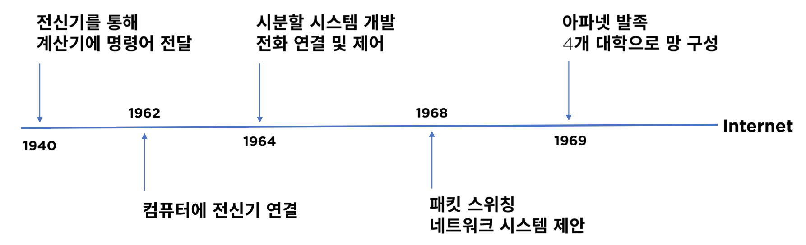

### 대한민국

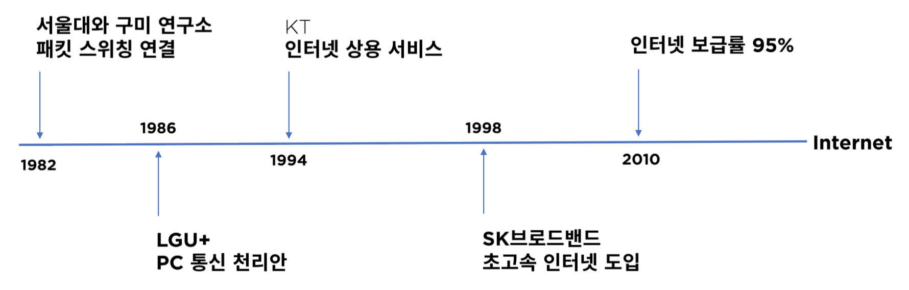

## 네트워크 구조
* Star, Ring, Mesh, Bus, Tree, Redundancy

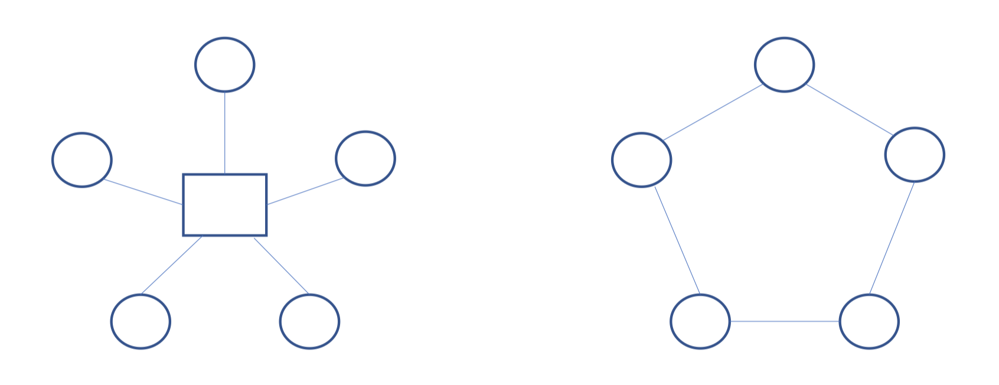

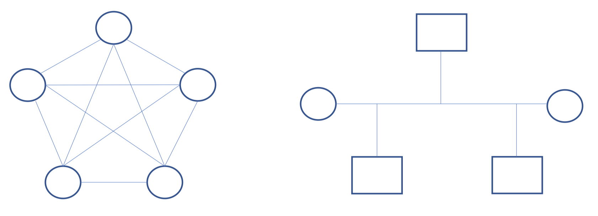

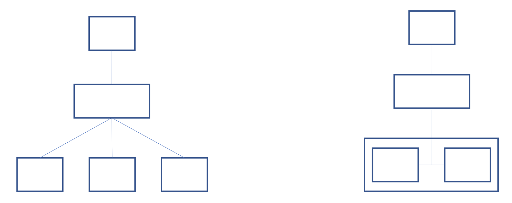

### 홈 네트워크
* 인터넷 - ISP - 모뎀 - 공유기 - 컴퓨터

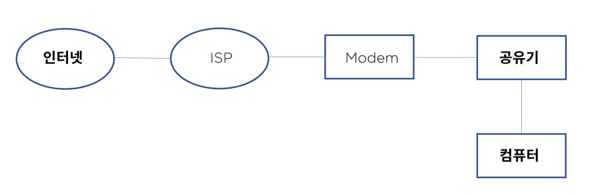

### 기업용 네트워크
* ISP - 전용선 - 라우터 - 방화벽 - L3 백본 - L2 스위치 - 서버, 컴퓨터
- L3 백본 - L4 로드밸런서 - DMZ

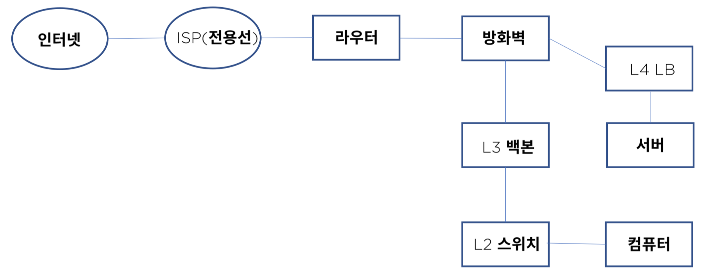

### 클라우드 네트워크 - AWS 기준
* 인터넷 - Route53 - IGW - VPC - ELB - Auto Scaling - Security Group - EC2

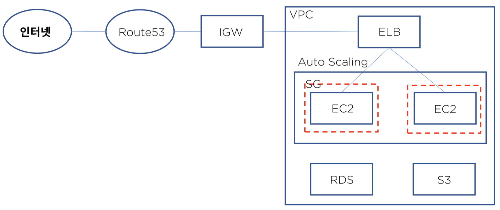

## OSI 7 Layer
### 정의
* 네트워크 프로토콜과 통신을 7계층으로 표현

### 목적
* 프로토콜을 기능별로 나누고 계층별로 구분
* 벤더간 호환성을 위한 표준 필요 -> 쉬운 접근성으로 기술의 발전

### OSI 7 Layer 모델

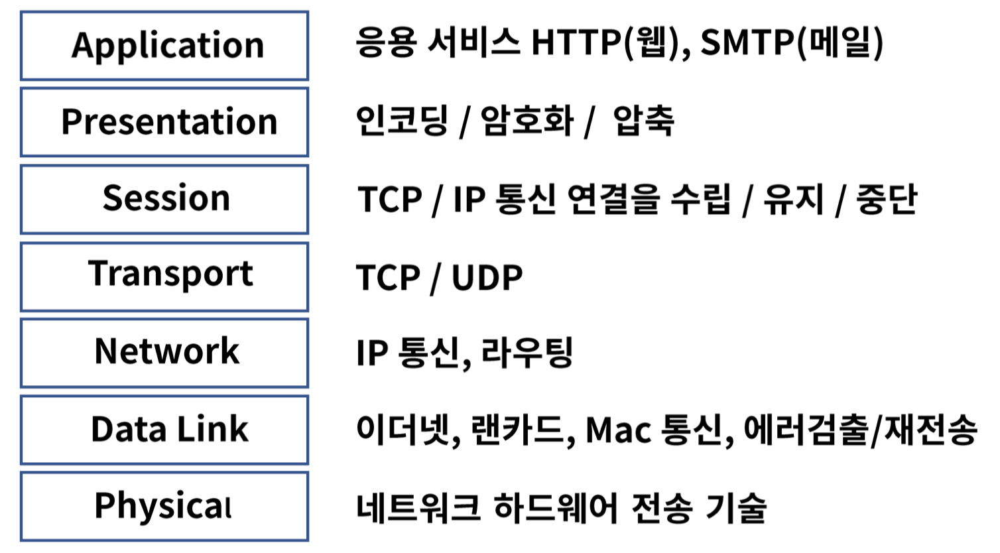

### 1계층 - Physical
* 장치와 통신 매체 사이의 비정형 데이터 전송 담당
* 디지털 bit(0 & 1)을 전기, 무선 또는 광 신호로 변환
* 전송되는 방법, 제어 신호, 기계적 속성 등을 정의
* 케이블, 인터페이스, 허브, 리피터 등이 이에 속함

### 2계층 - Data Link
* 동일 네트워크 내에서 데이터 전송, 링크를 통해서 연결을 설정하고 관리
* 물리계층에서 발생할 수 있는 오류를 감지하고 수정
* MAC(Media Access Control), LLC(Logical Link Control)
* 모뎀, 스위치

### 3계층 - Network
* 다른 네트워크로 데이터 전송, IP(Internet Protocol) 주소로 통신
* 출발지 IP에서 목적지 IP로 데이터 통신 시 중간에서 라우팅 처리
* 데이터가 큰 경우 분할 및 전송 후 목적지에서 재 조립하여 메시지 구현
* IP통신과 라우팅
* L3스위치, 라우터

### 4계층 - Transport
* 호스트 간의 데이터(서비스) 전송
* 오류 복구 및 흐름 제어, 완벽한 데이터 전송을 보장
* TCP/UDP
* L4 계층을 특정 하드웨어로 구분하기가 모호
* Port를 제어한다는 의미로 L4 로드 밸런서가 있다

### 5계층 - Session
* 로컬 및 원격 애플리케이션 간의 IP/Port 연결을 관리
* Session Table

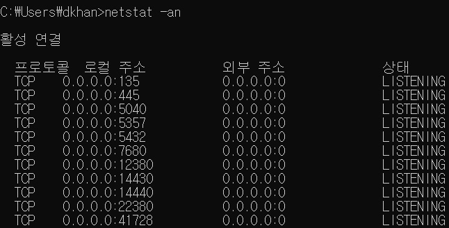

### 6계층 - Presentation
* 사용자 프로그램과 네트워크 형식간에 데이터를 변환하여 표현과 독립성을 제공
* 인코딩, 디코딩, 암호화, 압축
* ASCII, JPG, MPEG

### 7계층 - Application
* 사용자와 가장 밀접한 소프트웨어
* 이메일 서비스 SMTP, 또는 파일전송 FTP 등

## TCP/IP 모델 비교와 캡슐화
### 정의
* 네트워크 프로토콜의 모음으로 패킷 통신 방식의 IP와 전송 조절 프로토콜인 TCP로 이루어져 있다.

### TCP/IP 모델

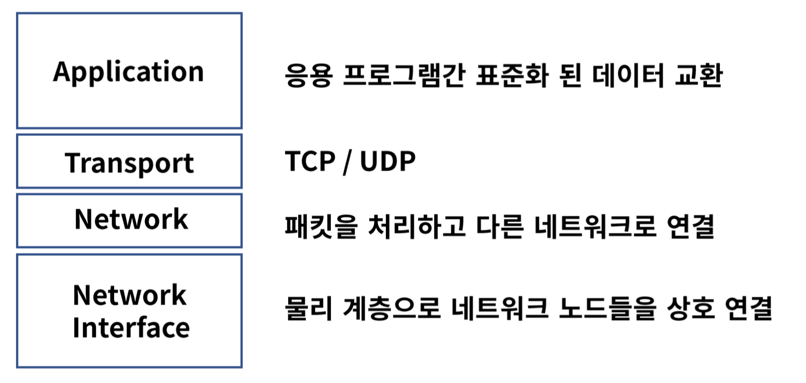

### TCP/IP와 OSI 7 Layer 비교

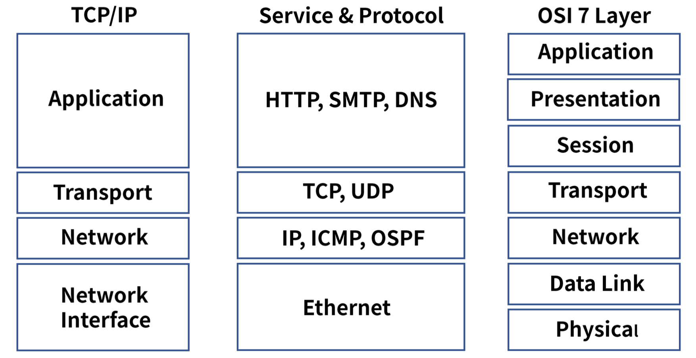

### 인캡슐레이션

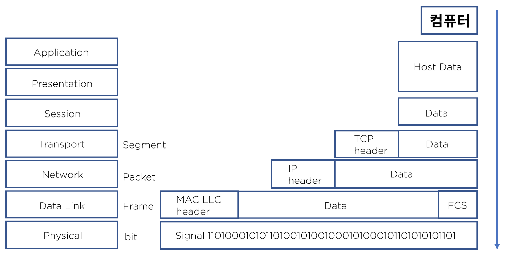

### 디캡슐레이션

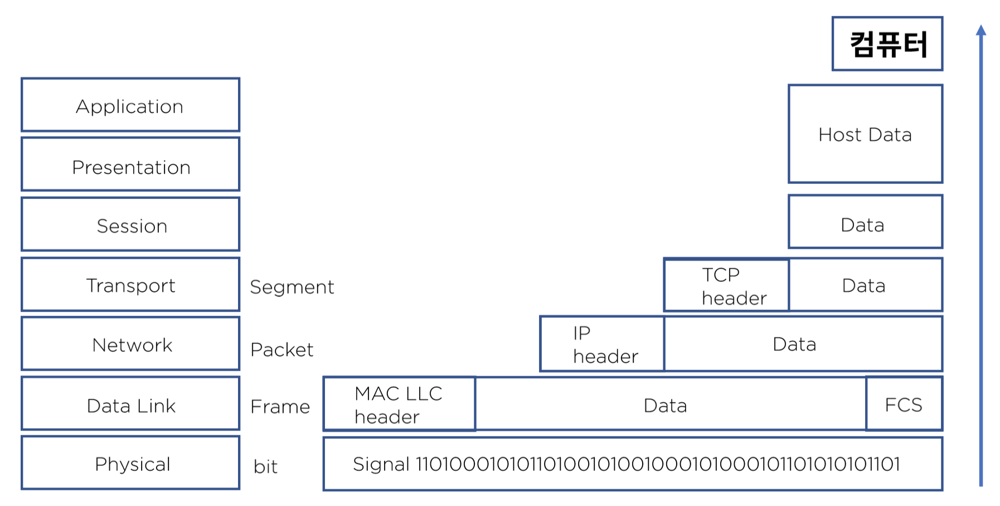


# 물리계층
## 물리계층의 역할과 기능
### 역할
* OSI 7 Layer의 1계층으로, 하드웨어로 표현
* 네트워크 장치의 전기적, 기계적 속성을 전송하는 수단을 정의
* 상위 계층인 데이터 링크 계층의 프레임을 신호로 인코딩하여 네트워크 장치로 전송
* 통신 장치와 커넥터, 인코딩(Bit -> Signal), 송수신을 담당하는 회로등의 요소가 있다.

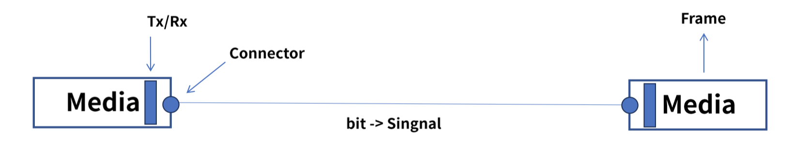

### Signaling의 종류
* 전기
* 광(빛)
* 전파

### Signaling의 전송 방식
* OSI 7 Layer 2계층의 Frame과 bit로 인코딩하여 통신한다.

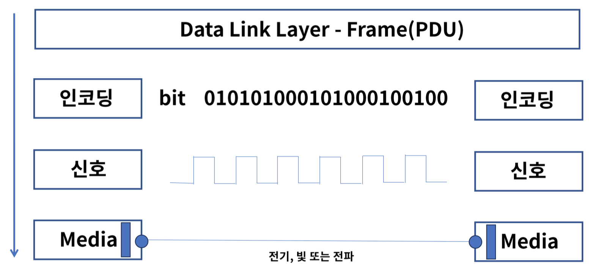


# HTTP의 GET과 POST
HTTP 프로토콜을 이용해서 서버에 무엇인가를 요청할 때 사용하는 방식이다. 

## GET
- 요청하는 데이터가 `HTTP Request Message`의 Header 부분에 url 이 담겨서 전송된다. 
- url 상에 `?` 뒤에 데이터가 붙어 request를 보낸다.
- url 이라는 공간에 담겨가기 때문에 전송할 수 있는 데이터의 크기가 제한적이다. 
- 보안이 필요한 데이터에 대해서는 데이터가 그대로 url 에 노출되므로 GET방식은 적절하지 않다. (ex. password)

## POST
- `HTTP Request Message`의 Body 부분에 데이터가 담겨서 전송된다.
- 바이너리 데이터를 요청하는 경우 POST 방식으로 보내야 하는 것처럼 데이터 크기가 GET 방식보다 크고 보안면에서 낫다.(하지만 보안적인 측면에서는 암호화를 하지 않는 이상 고만고만하다.)

## 비교
### 용도
* 우선 GET 은 가져오는 것이다. 서버에서 어떤 데이터를 가져와서 보여준다거나 하는 용도이지 서버의 값이나 상태 등을 변경하지 않는다. SELECT 적인 성향을 갖고 있다고 볼 수 있는 것이다. 
* 반면에 POST 는 서버의 값이나 상태를 변경하기 위해서 또는 추가하기 위해서 사용된다.

### Caching
* 부수적인 차이점을 좀 더 살펴보자면 GET 방식의 요청은 브라우저에서 Caching 할 수 있다.
* POST 방식으로 요청해야 할 것을 보내는 데이터의 크기가 작고 보안적인 문제가 없다는 이유로 GET 방식으로 요청한다면 기존에 caching 되었던 데이터가 응답될 가능성이 존재한다.

# TCP Handshake
## TCP 3-way Handshake
TCP 3 Way Handshake는 TCP/IP프로토콜을 이용해서 통신을 하는 응용프로그램이 데이터를 전송하기 전에 먼저 정확한 전송을 보장하기 위해 상대방 컴퓨터와 사전에 세션을 수립하는 과정을 의미한다.

### 동작과정

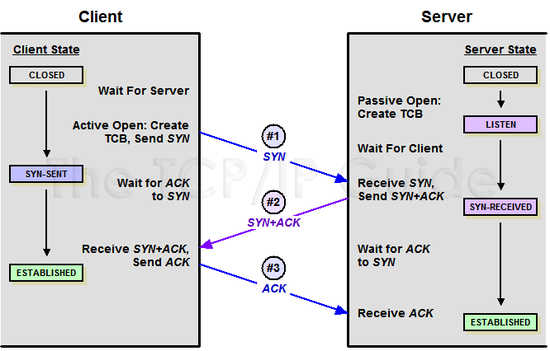

1. A클라이언트는 B서버에 접속을 요청하는 SYN 패킷을 보낸다. 이때 A클라이언트는 `SYN` 을 보내고 `SYN/ACK` 응답을 기다리는 `SYN_SENT` 상태가 된다.
2. 이때 서버는 `Listen` 상태로 포트 서비스가 가능한 상태여야 한다. B서버는 `SYN`요청을 받고 A클라이언트에게 요청을 수락한다는 `ACK` 와 `SYN` flag가 설정된 패킷을 발송하고 A가 다시 `ACK`으로 응답하기를 기다린다. 이때 B서버는 `SYN_RECEIVED` 상태가 된다.
3. A클라이언트는 B서버에게 `ACK`을 보내고 이후부터는 연결이 이루어지고 데이터가 오가게 되는것이다. 이때의 B서버 상태가 `ESTABLISHED`이다.

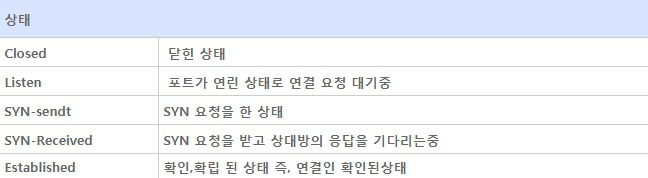

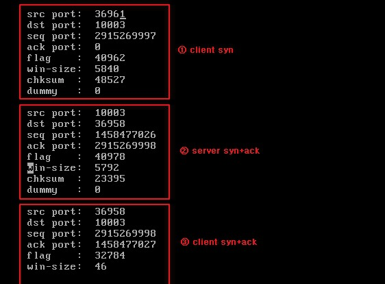

### 통신하기 이전에 연결을 위해서 사용되는 이유 
TCP 3-way Handshake는 양쪽 모두 데이터를 전송할 준비가 되었다는 것을 보장하기 위해 상대방 컴퓨터와 사전에 세션을 수립 하는 과정을 의미한다. 즉, 3-way Handshake는 데이터를 전송하기 전 정확한 전송을 보장하기 위해 사용된다. 

### 취약점
3 way handshaking의 취약점을 이용해 서버를 공격 하는 방법이 있는데 이를 `SYN Flooding` 이라한다.

3way handshaking 과정중 서버는 2단계 에서 (클라이언트로 부터 요청을받고 응답을 하고난후 다시 클라이언트의 응답을 기다리는 상태) 이 연결을 메모리 공간인 `백로그큐(Backlog Queue)`에 저장을 하고 클라이언트의 응답 즉 3단계를 기다리게 되고 일정 시간 (UNIX/LINUX : 60초 , Windows : 256초 , Apache : 300초) 동안 응답이 없으면 연결을 초기화한다. 바로 이 점을 이용한 공격법이다.

악의적인 공격자가 실제로 존재하지 않는 클라이언트 IP로 응답이 없는 연결을 초기화 하기전에 또 새로운 연결 즉 1단계 요청만 무수히 많이 보내어 백로그 큐를 **포화** 상태로 만들어 다른 사용자로 부터 더이상에 연결 요청을 못 받게 하는 공격 방법이다.

대응책으로는 연결 타이머 시간을 짧게 하거나 백로그 큐 사이즈를 늘리는법, 정해진 시간동안 들어오는 연결 요구의 수를 제한하는법, 쿠키(cookie)라는 것을 이용해서 전체 연결이 설정되기 전까지는 자원의 할당을 연기하는 법이 있다.

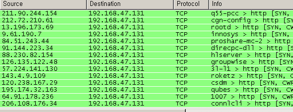

## TCP 4-Way Handshake
3-Way handshake는 TCP의 연결을 초기화 할 때 사용한다면, 4-Way handshake는 **세션을 종료**하기 위해 수행되는 절차이다.

### 동작과정


1. 클라이언트가 연결을 종료하겠다는 FIN플래그를 전송한다.
2. 서버는 일단 확인메시지를 보내고 자신의 통신이 끝날때까지 기다리는데 이 상태가TIME_WAIT상태다.
3. 서버가 통신이 끝났으면 연결이 종료되었다고 클라이언트에게 FIN플래그를 전송한다.
4. 클라이언트는 확인했다는 메시지를 보낸다.

### TIME_WAIT 단계
그런데 만약 Server에서 FIN을 전송하기 전에 전송한 패킷이 Routing 지연이나 패킷 유실로 인한 재전송 등으로 인해 FIN패킷보다 늦게 도착하는 상황이 발생한다면 어떻게 될까요? Client에서 세션을 종료시킨 후 뒤늦게 도착하는 패킷이 있다면 이 패킷은 Drop되고 데이터는 유실될 것입니다.

이러한 현상에 대비하여 Client는 Server로부터 FIN을 수신하더라도 일정시간(디폴트 240초) 동안 세션을 남겨놓고 잉여 패킷을 기다리는 과정을 거치게 되는데 이 과정을 “TIME_WAIT” 라고 합니다.

### 연결이 종료되는 시점에 사용되는 이유
연결 종료를 3-way Handshake가 아닌 4-way Handshake로 하는 이유는 클라이언트가 데이터 전송을 끝마쳤다 하더라도 서버는 아직 보낼 데이터가 남아있을 수 있는 경우를 대비하기 위해서이다. 

일단 `FIN`에 대한 `ACK`만 먼저 보내고 데이터를 모두 전송한 후에 자신도 `FIN` 메시지를 보낸 경우를 확인하기 위해서 한 단계를 더 거친다. 따라서 클라이언트가 서버로부터 `FIN`을 수신하더라도 일정시간 세션을 유지하는 `TIME-WAIT` 상태가 되는 이유는, 서버에서 `FIN` 을 전송하기전에 클라이언트에서 전송한 패킷이 라우팅 지연이나 패킷 유실로 인한 재전송 등으로 인해 해당 `ACK` 패킷이 `FIN` 패킷보다 늦게 도착하는 상황을 체크하기 위해서이다. 이 과정에선 일정시간(default 240) 동안 세션을 남겨 놓고 잉여 패킷을 모두 체크한다. 

# TCP와 UDP의 비교
## UDP
- UDP(User Datagram Protocol, 사용자 데이터그램 프로토콜)
- 비연결형 프로토콜이다. 
- IP 데이터그램을 캡슐화하여 보내는 방법과 연결 설정을 하지 않고 보내는 방법을 제공한다. 
- UDP는 흐름제어, 오류제어 또는 손상된 세그먼트의 수신에 대한 재전송을 하지 않는다. 이 모두가 사용자 프로세스의 몫이다. 
- UDP가 행하는 것은 포트들을 사용하여 IP 프로토콜에 인터페이스를 제공하는 것이다.
- 종종 클라이언트는 서버로 짧은 요청을 보내고, 짧은 응답을 기대한다. 
- 만약 요청 또는 응답이 손실된다면, 클라이언트는 time out 되고 다시 시도할 수 있으면 된다. 
- 코드가 간단할 뿐만 아니라 TCP 처럼 초기설정(initial setup)에서 요구되는 프로토콜보다 적은 메시지가 요구된다.

### 활용
- UDP를 사용한 것들에는 DNS가 있다. 어떤 호스트 네임의 IP 주소를 찾을 필요가 있는 프로그램은, DNS 서버로 호스트 네임을 포함한 UDP 패킷을 보낸다. 이 서버는 호스트의 IP 주소를 포함한 UDP 패킷으로 응답한다. 사전에 설정이 필요하지 않으며 그 후에 해제가 필요하지 않다.

## TCP
* TCP(Transmission Control Protocol, 전송제어 프로토콜)는 신뢰성이 없는 인터넷을 통해 종단간에 신뢰성 있는 바이트 스트림을 전송 하도록 특별히 설계되었다. 
* 신뢰성과 순차적인 전달이 필요할 때 사용한다.
* TCP 서비스는 송신자와 수신자 모두가 소켓이라고 부르는 종단점을 생성함으로써 이루어진다. 
* TCP 에서 연결 설정(connection establishment)는 3-way handshake를 통해 행해진다.
* 모든 TCP 연결은 전이중(full-duplex), 점대점(point to point)방식이다. 전이중이란 전송이 양방향으로 동시에 일어날 수 있음을 의미하며 점대점이란 각 연결이 정확히 2 개의 종단점을 가지고 있음을 의미한다. 
* TCP는 멀티캐스팅이나 브로드캐스팅을 지원하지 않는다.


# HTTP와 HTTPS
## HTTP와 TCP
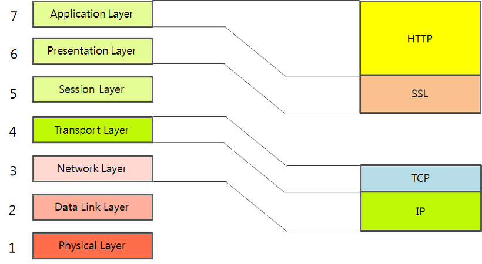

HTTP는 TCP를 기반으로 동작한다. Socket과 달리 연결 후 데이터를 전송하고, 바로 연결을 끊는다.


## HTTP의 문제점
* HTTP 는 평문 통신이기 때문에 도청이 가능하다.
* 통신 상대를 확인하지 않기 때문에 위장이 가능하다.
* 완전성을 증명할 수 없기 때문에 변조가 가능하다.
위 세 가지는 다른 암호화하지 않은 프로토콜에도 공통되는 문제점들이다.

## 보안 기법
1. 통신 자체를 암호화 SSL(Secure Socket Layer) or TLS(Transport Layer Security)라는 다른 프로토콜을 조합함으로써 HTTP 의 통신 내용을 암호화할 수 있다. SSL 을 조합한 HTTP를 HTTPS(HTTP Secure) or HTTP over SSL이라고 부른다.
2. 콘텐츠를 암호화 말 그대로 HTTP 를 사용해서 운반하는 내용인, HTTP 메시지에 포함되는 콘텐츠만 암호화하는 것이다. 암호화해서 전송하면 받은 측에서는 그 암호를 해독하여 출력하는 처리가 필요하다.

## 통신 상대를 확인하지 않기 때문에 위장이 가능하다.
* HTTP에 의한 통신에는 상대가 누구인지 확인하는 처리는 없기 때문에 누구든지 리퀘스트를 보낼 수 있다. IP 주소나 포트 등에서 그 웹 서버에 액세스 제한이 없는 경우 리퀘스트가 오면 상대가 누구든지 무언가의 리스폰스를 반환한다. 
* 이러한 특징은 여러 문제점을 유발한다.
	1. 리퀘스트를 보낸 곳의 웹 서버가 원래 의도한 리스폰스를 보내야 하는 웹 서버인지를 확인할 수 없다.
	2. 리스폰스를 반환한 곳의 클라이언트가 원래 의도한 리퀘스트를 보낸 클라이언트인지를 확인할 수 없다.
	3. 통신하고 있는 상대가 접근이 허가된 상대인지를 확인할 수 없다.
	4. 어디에서 누가 리퀘스트 했는지 확인할 수 없다.
	5. 의미없는 리퀘스트도 수신한다. —> DoS 공격을 방지할 수 없다.

### 보완 방법
* SSL로 상대를 확인할 수 있다. 
* SSL은 상대를 확인하는 수단으로 증명서 를 제공하고 있다. 증명서는 신뢰할 수 있는 제 3 자 기관에 의해 발행되는 것이기 때문에 서버나 클라이언트가 실재하는 사실을 증명한다.
* 증명서를 이용함으로써 통신 상대가 내가 통신하고자 하는 서버임을 나타내고 이용자는 개인 정보 누설 등의 위험성이 줄어들게 된다. 
* 한 가지 이점을 더 꼽자면 클라이언트는 이 증명서로 본인 확인을 하고 웹 사이트 인증에서도 이용할 수 있다.

## 완전성을 증명할 수 없기 때문에 변조가 가능하다
* 여기서 완전성이란 정보의 정확성 을 의미한다. 
* 서버 또는 클라이언트에서 수신한 내용이 송신측에서 보낸 내용과 일치한다라는 것을 보장할 수 없는 것이다. 
* 리퀘스트나 리스폰스가 발신된 후에 상대가 수신하는 사이에 누군가에 의해 변조되더라도 이 사실을 알 수 없다. 
* 공격자가 도중에 리퀘스트나 리스폰스를 빼앗아 변조하는 공격을 중간자 공격(Man-in-the-Middle)이라고 부른다.

### 보완 방법
* MD5, SHA-1 등의 해시 값을 확인하는 방법과 파일의 디지털 서명을 확인하는 방법이 존재하지만 확실히 확인할 수 있는 것은 아니다. 
* 확실히 방지하기에는 HTTPS를 사용해야 한다. SSL 에는 인증이나 암호화, 그리고 다이제스트 기능을 제공하고 있다.

## HTTPS
* HTTP 통신하는 소켓 부분을 SSL(Secure Socket Layer) or TLS(Transport Layer Security)라는 프로토콜로 대체한다.
* HTTP는 원래 TCP 와 직접 통신했지만, HTTPS 에서 HTTP는 SSL 과 통신하고 SSL이 TCP와 통신 하게 된다. SSL을 사용한 HTTPS는 암호화와 증명서, 안전성 보호를 이용할 수 있게 된다.
* HTTPS 의 SSL 에서는 공통키 암호화 방식과 공개키 암호화 방식을 혼합한 하이브리드 암호 시스템을 사용한다. 공통키를 공개키 암호화 방식으로 교환한 다음에 다음부터의 통신은 공통키 암호를 사용하는 방식이다.

### 모든 웹 페이지에서 HTTPS를 사용해도 될까?
* 평문 통신에 비해서 암호화 통신은 CPU나 메모리 등 리소스를 더 많이 요구한다. 통신할 때마다 암호화를 하면 추가적인 리소스를 소비하기 때문에 서버 한 대당 처리할 수 있는 리퀘스트의 수가 상대적으로 줄어들게 된다.
* 하지만 최근에는 하드웨어의 발달로 인해 HTTPS를 사용하더라도 속도 저하가 거의 일어나지 않으며, 새로운 표준인 HTTP 2.0을 함께 이용한다면 오히려 HTTPS가 HTTP보다 더 빠르게 동작한다. 
* 따라서 웹은 과거의 민감한 정보를 다룰 때만 HTTPS에 의한 암호화 통신을 사용하는 방식에서 현재 모든 웹 페이지에서 HTTPS를 적용하는 방향으로 바뀌어가고 있다.

# DNS round robin
Domain 에 대한 IP 요청 쿼리 시 round-robin 방식으로 IP 를 반환한다.

## DNS Round Robin 방식의 문제점
1. 서버의 수 만큼 공인 IP 주소가 필요함 
	* 부하 분산을 위해 서버의 대수를 늘리기 위해서는 그 만큼의 공인 IP 가 필요하다.
2. 균등하게 분산되지 않음
	* 모바일 사이트 등에서 문제가 될 수 있는데, 스마트폰의 접속은 캐리어 게이트웨이 라고 하는 프록시 서버를 경유 한다. 프록시 서버에서는 이름변환 결과가 일정 시간 동안 캐싱되므로 같은 프록시 서버를 경유 하는 접속은 항상 같은 서버로 접속된다. 
	* PC 용 웹 브라우저도 DNS 질의 결과를 캐싱하기 때문에 균등하게 부하분산 되지 않는다. 
	* DNS 레코드의 TTL 값을 짧게 설정함으로써 어느 정도 해소가 되지만, TTL 에 따라 캐시를 해제하는 것은 아니므로 반드시 주의가 필요하다.
3. 서버가 다운되어도 확인 불가 
	* DNS 서버는 웹 서버의 부하나 접속 수 등의 상황에 따라 질의결과를 제어할 수 없다. 웹 서버의 부하가 높아서 응답이 느려지거나 접속수가 꽉 차서 접속을 처리할 수 없는 상황인 지를 전혀 감지할 수가 없기 때문에 어떤 원인으로 다운되더라도 이를 검출하지 못하고 유저들에게 제공한다. 이때문에 유저들은 간혹 다운된 서버로 연결이 되기도 한다. 
	* DNS 라운드 로빈은 어디까지나 부하분산 을 위한 방법이지 다중화 방법은 아니므로 다른 S/W 와 조합해서 관리할 필요가 있다.

## 해결 방법
### Weighted round robin (WRR)
* 각각의 웹 서버에 가중치를 가미해서 분산 비율을 변경한다. 가중치가 큰 서버일수록 빈번하게 선택되므로 처리능력이 높은 서버는 가중치를 높게 설정하는 것이 좋다.
### Least connection
* 접속 클라이언트 수가 가장 적은 서버를 선택한다. 로드밸런서에서 실시간으로 connection 수를 관리하거나 각 서버에서 주기적으로 알려주는 것이 필요하다.

# 웹 통신의 큰 흐름
우리가 Chrome 을 실행시켜 주소창에 특정 URL 값을 입력시키면 어떤 일이 일어나는가?

## in 브라우저
1. URL에 입력된 값을 브라우저 내부에서 결정된 규칙에 따라 그 의미를 조사한다.
2. 조사된 의미에 따라 HTTP Request 메시지를 만든다.
3. 만들어진 메시지를 웹 서버로 전송한다.

* 이 때 만들어진 메시지 전송은 브라우저가 직접하는 것이 아니다. 
* 브라우저는 메시지를 네트워크에 송출하는 기능이 없으므로 OS에 의뢰하여 메시지를 전달한다. 우리가 택배를 보낼 때 직접 보내는게 아니라, 이미 서비스가 이루어지고 있는 택배 시스템(택배 회사)을 이용하여 보내는 것과 같은 이치이다. 
* 단, OS에 송신을 의뢰할 때는 도메인명이 아니라 ip주소로 메시지를 받을 상대를 지정해야 하는데, 이 과정에서 DNS서버를 조회해야 한다.

## in 프로토콜 스택, LAN 어댑터
1. 프로토콜 스택(운영체제에 내장된 네트워크 제어용 소프트웨어)이 브라우저로부터 메시지를 받는다. (Encapsulation)
2. 브라우저로부터 받은 메시지를 패킷 속에 저장한다.
3. 그리고 수신처 주소 등의 제어정보를 덧붙인다.
4. 그런 다음, 패킷을 LAN 어댑터에 넘긴다.
5. LAN 어댑터는 다음 Hop의 MAC 주소를 붙인 프레임을 전기신호로 변환시킨다.
6. 신호를 LAN 케이블에 송출시킨다.

* 프로토콜 스택은 통신 중 오류가 발생했을 때, 이 제어 정보를 사용하여 고쳐 보내거나, 각종 상황을 조절하는 등 다양한 역할을 하게 된다. 
* 네트워크 세계에서는 비서가 있어서 우리가 비서에게 물건만 건네주면, 받는 사람의 주소와 각종 유의사항을 써준다. 여기서는 프로토콜 스택이 비서의 역할을 한다고 볼 수 있다.

## in 허브, 스위치, 라우터
1. LAN 어댑터가 송신한 프레임은 스위칭 허브를 경유하여 인터넷 접속용 라우터에 도착한다.
2. 라우터는 라우팅 테이블을 참조하여 패킷을 포워딩하고, 프로바이더(통신사)에게 전달한다.

## in 액세스 회선, 프로바이더
1. 패킷은 인터넷의 입구에 있는 액세스 회선(통신 회선)에 의해 POP(Point Of Presence, 통신사용 라우터)까지 운반된다.
2. POP 를 거쳐 인터넷의 핵심부로 들어가게 된다.
3. 수 많은 고속 라우터들 사이로 패킷이 목적지를 향해 흘러가게 된다.

## in 방화벽, 캐시서버
1. 패킷은 인터넷 핵심부를 통과하여 웹 서버측의 LAN 에 도착한다.
2. 기다리고 있던 방화벽이 도착한 패킷을 검사한다.
3. 패킷이 웹 서버까지 가야하는지 가지 않아도 되는지를 판단하는 캐시서버가 존재한다.

* 굳이 서버까지 가지 않아도 되는 경우를 골라낸다. 액세스한 페이지의 데이터가 캐시서버에 있으면 웹 서버에 의뢰하지 않고 바로 그 값을 읽을 수 있다. 
* 페이지의 데이터 중에 다시 이용할 수 있는 것이 있으면 캐시 서버에 저장된다.

## in 웹 서버
1. 패킷이 물리적인 웹 서버에 도착하면 웹 서버의 프로토콜 스택은 패킷을 추출하여 메시지를 복원하고 웹 서버 애플리케이션에 넘긴다. (Decapsulation)
2. 메시지를 받은 웹 서버 애플리케이션은 요청 메시지에 따른 데이터를 응답 메시지에 넣어 클라이언트로 회송한다.
3. 왔던 방식대로 응답 메시지가 클라이언트에게 전달된다.


# Router
라우터는 IP네트워크, 서브넷을 관리하면서 다른 네트워크를 거쳐 패킷을 전송하는 역할을 하는 장비이고, 라우팅은 그 패킷을 보낼 경로를 선택하는 과정이라고 볼 수 있다.

## 동작 원리
라우터는 패킷의 전송경로를 결정하기 위해 랜테이블, 네트워크테이블, 라우팅테이블을 사용한다. 라우터는 위의 3가지 테이블을 관리함으로써 다른 네트워크에 연결된 장치들을 비롯하여 네트워크에 연결된 모든 장치들의 주소를 인식하고 이것을 바탕으로 패킷의 전송경로를 결정한다.

동일 네트워크 상에 있는 장치로 패킷을 보낼 때 라우터에서는 아래 순서를 매번 거친다.

1. 랜테이블 검사를 한다. 이곳에서는 패킷의 목적지가 같은 네트워크에 있는지 아니면 다른 네트워크에 있는지를 확인한다.
2. 네트워크테이블을 검사하여 패킷을 전달할 네트워크 주소를 찾아낸다.
3. 라우팅테이블을 검색하여 가장 적합한 경로를 찾아내서 패킷을 보낸다.

### 랜테이블
* 랜테이블은 라우터에 연결되어 있는 랜 세그먼트 내 장치의 주소를 관리하고 있으며 필터링작업에 사용된다.
### 네트워크 테이블
* 네트워크상의 모든 라우터의 주소를 보관하며 패킷의 수신지 라우터를 식별하는데 사용된다.
### 라우팅 테이블
* 각각의 라우터에 구축되어 있으며 각 경로에 대한 정보를 유지하고 있어서 다른 세그먼트로 전송 되는 패킷의 가장 효율적인 경로를 결정하는데 사용된다.

## 목적지 학습방법
### Connected
* 자신과 물리적으로 직접 연결되어있는 장비의 IP 주소를 자동으로 알아온다. 이때 IP는 네트워크 주소로 라우팅 테이블에 저장된다.
### Static
* 관리자가 직접 라우팅 경로를 선택해서 보내는 설정.
* 장점 : 관리자가 테이터가 전송될 경로를 직접 설정하므로 경로관리에 가장 효율적이다.
* 단점 : 네트워크 변화에 대한 대처가 느리다.
### Dynamic
* 각 라우터들이 갖고 있는 정보를 서로에게 공유하여 라우팅 테이블에 저장한다. 주시적으로 최적경로를 계산하여 라우팅 테이블의 정보를 유지하는 방식이다.
* 장점 : 네트워크 변화에 대한 대처가 빠르다.
* 단점 : 주기적으로 경로를 계산해야하므로 리소스 소비량(CPU사용량)이 많아진다.
### Redistribution
* 정보 교환이 이루어지지 않는 장비끼리 관리자가 강제로 교환하는 방식.


# 용어 정리
## 핑
### 스니핑
* 스니프(Sniff) 라는 용어는 흔히 “냄새를 맡다.”, “킁킁거리다” 라는 사전적인 뜻으로 네트워크 상에 지나다니는 패킷들을 캡처하여 그 안에 있는 내용을 들여다보는 기술을 말한다.

### 스푸핑
* **스푸핑**(Spoofing)의 사전적 의미는 ‘속이다’이다. 네트워크에서 스푸핑 대상은  [MAC 주소](https://ko.wikipedia.org/wiki/MAC_%EC%A3%BC%EC%86%8C) ,  [IP주소](https://ko.wikipedia.org/wiki/IP%EC%A3%BC%EC%86%8C) ,  [포트](https://ko.wikipedia.org/wiki/%EC%BB%B4%ED%93%A8%ED%84%B0_%EC%86%8C%ED%94%84%ED%8A%B8%EC%9B%A8%EC%96%B4_%ED%8F%AC%ED%8A%B8)  등 네트워크 통신과 관련된 모든 것이 될 수 있고, 스푸핑은 속임을 이용한 공격을 총칭한다.

#### ARP 스푸핑
* ARP 스푸핑은 MAC 주소를 속여 랜에서의 통신 흐름을 왜곡시키는 공격이다. 공격 대상 컴퓨터와 서버 사이의 트래픽을 공격자의 컴퓨터로 우회시켜 패스워드 정보등 원하는 정보를 획득 할 수 있다.
#### IP 스푸핑
* IP 스푸핑은 IP 자체의 보안 취약성을 악용한 것으로 자신의 IP주소를 속여서 접속하는 공격이다.
#### DNS 스푸핑
* DNS 프로토콜은 인터넷 연결시 도메인 주소를 실제 IP 주소로 대응시켜 주는 프로토콜이다. 
* 정상적인 접속에서는 사용자가 접속하고자 하는 사이트에 대한 IP주소를 DNS서버에서 받아와야 한다. 그러나 공격자가 DNS서버를 장악하거나 사용자와 DNS사이의 트래픽을 스니핑하여 공격자가 설정한 임의의 IP주소를 사용자에게 보내 원하는 사이트로 이동시키는 것과 같은 공격이 DNS스푸핑이다.

### 스머핑
* **스머핑**은 희생자의  [스푸핑](https://ko.wikipedia.org/wiki/IP_%EC%A3%BC%EC%86%8C_%EC%8A%A4%ED%91%B8%ED%95%91) 된 원본 IP를 가진 수많은  [인터넷 제어 메시지 프로토콜](https://ko.wikipedia.org/wiki/%EC%9D%B8%ED%84%B0%EB%84%B7_%EC%A0%9C%EC%96%B4_%EB%A9%94%EC%8B%9C%EC%A7%80_%ED%94%84%EB%A1%9C%ED%86%A0%EC%BD%9C) (ICMP) 패킷들이 IP  [브로드캐스트 주소](https://ko.wikipedia.org/w/index.php?title=%EB%B8%8C%EB%A1%9C%EB%93%9C%EC%BA%90%EC%8A%A4%ED%8A%B8_%EC%A3%BC%EC%86%8C&action=edit&redlink=1) 를 사용하여  [컴퓨터 네트워크](https://ko.wikipedia.org/wiki/%EC%BB%B4%ED%93%A8%ED%84%B0_%EB%84%A4%ED%8A%B8%EC%9B%8C%ED%81%AC) 로 브로드캐스트하는  [분산 서비스 거부 공격](https://ko.wikipedia.org/wiki/%EC%84%9C%EB%B9%84%EC%8A%A4_%EA%B1%B0%EB%B6%80_%EA%B3%B5%EA%B2%A9) 이다.

### 스누핑
* 스누핑의 Snoop은 ‘기웃거리다, 염탐하다’라는 뜻을 가지고 있다. 스누핑은 프로토콜 분석용 소프트웨어를 지칭하며, 네트워크상에 떠도는 중요 정보를 몰래 획득하는 행위를 말한다.  [스피닝](http://wiki.hash.kr/index.php?title=%EC%8A%A4%ED%94%BC%EB%8B%9D&action=edit&redlink=1) 도 유사한 의미가 있으나, 스니핑은 주로 몰래 엿듣는 의미가 강하다.

#### IGMP 스누핑
* IGMP는 Internet Group Management Protocol의 약자로 Internet Protocol Multicast Group들의 멤버십을 관리하는 통신 규약이다. IGMP는 인터넷 컴퓨터가 멀티캐스트 그룹을 인근의 라우터들에게 알리는 수단을 제공하는 인터넷 프로토콜이다.
* IGMP 스누핑은 IGMP 트래픽을 감지하기 위한 것이다. 스위치가 라우터와 클라이언트 사이에 벌어지는 IGMP 송수신을 스위치에서 Layer 3에서 주고 받아지는 멀티캐스트 패킷 프로세싱에 의해 감지하도록 한다.
#### DHCP 스누핑
* DHCP란 Dynamic Host Configuration Protocol의 약자로서, 호스트의 IP주소와 각종 TCP/IP 프로토콜의 기본 설정을 클라이언트에게 자동으로 제공해주는 프로토콜이다.
* DHCP Snooping이란 DHCP 서버를 보호하기 위해 사용하는 기능이다. DHCP 스푸핑을 방어하기 위해 스위치키 DHCP 메시지의 내부까지 확인한다.

## 캐스트
### 유니캐스트(Unicast)
* 유니캐스트는 정보를 전송하기 위한 프레임에 자신의 MAC 주소와 목적지의 MAC 주소를 첨부하여 전송하는 방식을 말한다. 
* 유니캐스트 방식은 가장 많이 사용하는 방식으로 한 개의 목적지 MAC 주소를 사용하고 CPU 성능에 문제를 주지 않는 방식이다.
* 1 대 1(특정 단일)

### 브로드캐스트(Broadcast)
* 브로드캐스트 방식은 로컬 네트워크에 연결되어 있는 모든 시스템에게 프레임을 보내는 방식을 말한다.
* 1 대 다수(불특정 다수)

### 멀티캐스트(Multicast)
* 멀티캐스트는 네트워크에 연결되어 있는 시스템 중 일부에게만 정보를 전송하는 것으로 특정 그룹에 속해 있는 시스템에게만 한 번에 정보를 전송할 수 있는 방법을 말한다. 
* 1 대 다수(특정 집단)

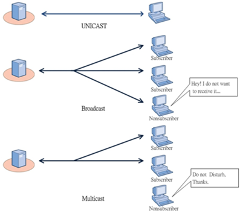

## URL과 URI
### URI
* URI는 특정 리소스를 식별하는 통합 자원 식별자(Uniform Resource Identifier)를 의미한다. 웹 기술에서 사용하는 논리적 또는 물리적 리소스를 식별하는 고유한 문자열 시퀀스다.
### URL
* URL은 흔히 웹 주소라고도 하며, 컴퓨터 네트워크 상에서 리소스가 어디 있는지 알려주기 위한 규약이다. URI의 서브셋이다.

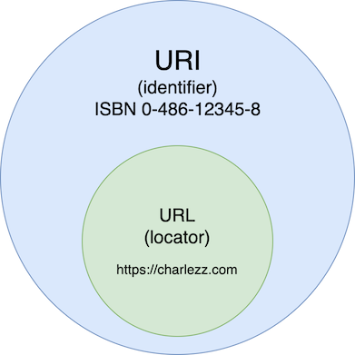

### 비교

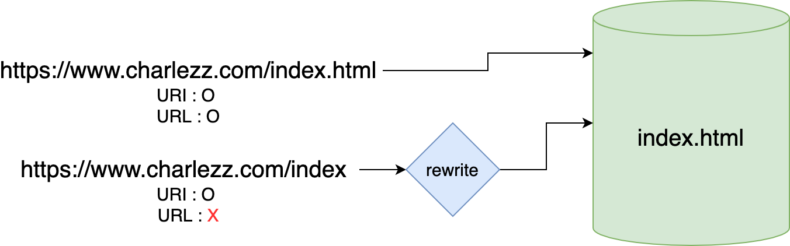

### 구조
일반 URI는 다음과 같은 형태를 나타낸다.
```
scheme:[//[user[:password]@]host[:port]][/path][?query][#fragment]
```

1. scheme : 사용할 프로토콜을 뜻하며 웹에서는 http 또는 https를 사용
2. user와 password : (서버에 있는) 데이터에 접근하기 위한 사용자의 이름과 비밀번호
3. host와 port : 접근할 대상(서버)의 호스트명과 포트번호
4. path : 접근할 대상(서버)의 경로에 대한 상세 정보
5. query : 접근할 대상에 전달하는 추가적인 정보 (파라미터)
6. fragment : 메인 리소스 내에 존재하는 서브 리소스에 접근할 때 이를 식별하기 위한 정보

## OSI 7 Layer 데이터 전송 단위
1. 물리 계층 : 비트
2. 데이터링크 계층 : 프레임
3. 네트워크 계층 : 패킷
4. 전송 계층 : Segment(TCP), Datagram(UDP)

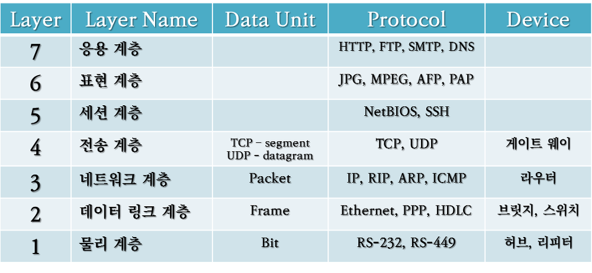

## 허브, 스위치 동작과정
### 허브
* 데이터를 받으면 입력 포트를 제외한 모든 포트에 브로드캐스트
### 스위치
* 데이터를 받으면 MAC Table에 따라 데이터 전송
* MAC Table에 없는 경우, 브로드캐스트 후 MAC Table에 학습


# Reference
* [Interview_Question_for_Beginner](https://github.com/JaeYeopHan/Interview_Question_for_Beginner) 
* [GitHub - gyoogle/tech-interview-for-developer: 👶🏻 신입 개발자 전공 지식 & 기술 면접 백과사전 📖](https://github.com/gyoogle/tech-interview-for-developer)
* [GitHub - WeareSoft/tech-interview: 🙍 tech interview](https://github.com/WeareSoft/tech-interview)


