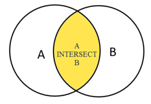
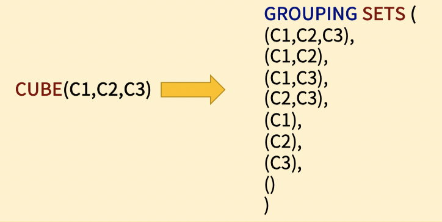

#SQL #SQLD

# 내 생각대로 SQL
# 내 생각대로 SQL - Basic
## About SQL
* SQL은 1974년에 SEQUEL (씨퀄)로 탄생 했지만, 지금 이름인 SQL로 변경 되어 지금까지 SQL 불린다. 그러나 에 스-큐-엘 이 아닌 씨퀄로 주로 발음된다.
* SEQUEL : A STRUCIURED ENGLISH QUERY LANGUAGE
* SQL : A STRUCIURED QUERY LANGUAGE

### SQL의 특성
* 절차적 언어(procedural language)가 아닌 선언적 언어(descriptive language)
	- 즉, 데이터를 처리하기 위한 방법을 기술하지 않고, 필요한 데이터 집합을 정의함.
* 데이터 처리 방법을 고민하지 않고 데이터 자체만 집중 할 수 있음.
	- 데이터 처리 방법은 SQL Query Optimizer 가 대신 처리함. 필요한 데이터 집합을 SQL 로 정의하면 Query Optimizer 가 SQL를 처리 데이터, 하드웨어, 테이블 구조를 고려하여 처리하기 때문에, Data Scientist, Data Analyst 는 Business Problem 에 더 집중할 수 있음.

* 플랫폼에 독립적임
	* 수정을 거의 하지 않고 다른 DBMS 에서도 활용할 수 있어 플랫폼에 독립적임 ( SQL on Hadoop 포함 심지어 Access 에서도!!)

### SQL 역할과 활용
* Data Preparation, Data Analysis에 활용 할 수 있다.
* Model과 Algorithm을 만드는데는 부분적으로 활용할 수 있다.


## 관계형 모델과 SQL
### 관계형 모델
* 관계형 모델(Relational Model) EF Codd 박사님이 1969년 만든 데이터 독립성이 보장된 최초의 데이터 모델입니다.


* 물리(Physical) = Ordering, Indexing, Access Path 종속적
* 논리(Logical) = 데이터 항목 자체에 집중


### Entity Relationship Diagram

* RDBM을 표현할 때 사용


## 실습 환경
### SQL 쿼리 Tool
* DBeaver 사용 : [DBeaver](https://dbeaver.io/download/)

## SELECT 문
* 일반적으로 테이블에 저장된 데이터를 가져오는데 쓰인다. SQL에서 가장 많이 쓰이는 문장이다.

### 문법
```sql
SELECT COLUMN_1, COLUMN_2, COLUMN_3, ....
FROM TABLE_NAME;
```

```sql
SELECT T.COLUMN_1, T.COLUMN_2, T.COLUMN_3, ....
FROM TABLE_NAME T;
```
* table name에 Alias를 사용할 수 있다.

### 예제
```sql
select * from customer;

select first_name, last_name, EMAIL from customer;
```

## ORDER BY 문
* SELECT문에서 가져온 데이터를 정렬하는데 사용한다. 업무 처리상 매우 중요한 기능이다.
### 문법
```sql
SELECT COLUMN_1, COLUMN_2
FROM TABLE_NAME
ORDER BY COLUMN_1 ASC, COLUMN_2 DESC
```

* 정렬 순서를 입력하지 않을 경우 ASC가 Default이다.
```sql
SELECT COLUMN_1, COLUMN_2
FROM TABLE_NAME
ORDER BY 1 ASC, 2 DESC
```

* 컬럼명 대신 정수를 입력해도 된다. (가독성은 낮음)

### 예제
```sql
select first_name, last_name from customer order by first_name asc;

select first_name, last_name from customer c order by first_name asc, last_name desc;

select first_name, last_name from customer c order by 1 asc, 2 desc;
```

## SELECT DISTINCT 문

* SELECT시 DISTINCT를 사용하면 중복값을 제외한 결과값이 출력된다. 즉 같은 결과의 행이라면 중복을 제거할 수 있다.

### 문법
```sql
SELECT DISTINCT COLUMN_1 FROM TABLE_NAME;

SELECT DISTINCT COLUMN_1, COLUMN_2 FROM TABLE_NAME;

SELECT DISTINCT COLUMN_1, COLUMN_2 FROM TABLE_NAME ORDER BY COLUMN_1, COLUMN_2;
```
* 컬럼을 2개 작성한 경우 COLUMN_1 + COLUMN_2의 중복값을 제거한다.

### 예제
```sql
select * from t1;

select distinct bcolor from t1 order by bcolor;

select distinct bcolor, fcolor from t1 order by bcolor, fcolor;

// bcolor 기준 중복 제거된 값이 기준 집합이 됨
select distinct on (bcolor) bcolor, fcolor from t1 order by bcolor, fcolor;
select distinct on (bcolor) bcolor, fcolor from t1 order by bcolor, fcolor desc;
```

## WHERE 절
* 집합을 가져올 때 어떤 집합을 가져올 것인지에 대한 조건을 설정하는 절이다.

### 문법
```sql
SELECT COLUMN_1, COLUMN_2, ... 
FROM TABLE_NAME
WHERE <조건>;
```
* 조건 :


### 예제
```sql
select first_name, last_name from customer where first_name = 'Jamie';

select first_name, last_name from customer where first_name = 'Jamie' and last_name = 'Rice';

select customer_id, amount, payment_date from payment where amount <= 1 or amount >= 8;
```

## 생각대로 SQL 1
```sql
문제1번) dvd 렌탈 업체의  dvd 대여가 있었던 날짜를 확인해주세요.
select
	distinct date(rental_date)
from
	rental

문제5번) 영화 카테고리 중에서 ,Sci-Fi  카테고리의  카테고리 번호는 몇번인가요?	
select
	category_id
from
	category c
where
	name = 'Sci-Fi';

문제6번) film 테이블을 활용하여, rating  등급(?) 에 대해서, 몇개의 등급이 있는지 확인해보세요. 	
select
	distinct rating
from
	film;

/*
PG-13
NC-17
G
PG
R
 */

문제7번) 대여 기간이 (회수 - 대여일) 10일 이상이였던 rental 테이블에 대한 모든 정보를 알려주세요.
단 , 대여기간은  대여일자부터 대여기간으로 포함하여 계산합니다.	
select
	*,
	date(return_date) - date(rental_date) + 1 as chk
from
	rental
where
	date(return_date) - date(rental_date) + 1 >= 10;

문제8번) 고객의 id 가  50,100,150 ..등 50번의 배수에 해당하는 고객들에 대해서, 
회원 가입 감사 이벤트를 진행하려고합니다.
고객 아이디가 50번 배수인 아이디와, 고객의 이름 (성, 이름)과 이메일에 대해서 
확인해주세요.	
select
	customer_id,
	last_name || ', ' || first_name as full_name ,
	email
from
	customer
where
	customer_id % 50 = 0;

문제10번)	city 테이블의 city 갯수는 몇개인가요?	
select
	count(distinct city_id)
from
	city;

문제11번)	영화배우의 이름 (이름+' '+성) 에 대해서,  대문자로 이름을 보여주세요.  단 고객의 이름이 동일한 사람이 있다면,  중복 제거하고, 알려주세요.	
select
	distinct UPPER(first_name || ' ' || last_name)
from
	actor;

문제17번)	film 테이블을 활용하여,  rental_duration 이  7일 이상 대여가 가능한  film 에 대해서  film_id,   title,  description 컬럼을 확인해보세요.	
select
	film_id,
	title,
	description,
	rental_duration
from
	film
where
	rental_duration >= 7;
```

## LIMIT 절
* 특정 집합을 출력 시 출력하는 행의 수를 한정하는 역할을 한다. 부분 범위 처리시 사용된다.

### 문법
```sql
select * from table_name limit n;

select * from table_name limit n offset m;
```

*  offset은 출력 시작위치를 지정한다.

### 예제
```sql
select film_id, title, release_year from film order by film_id limit 5;

select film_id, title, release_year from film order by film_id limit 4 offset 3;

select film_id, title, rental_rate from film order by rental_rate desc limit 10;
```

*  `offset n` 일 경우 n+1 행부터 출력한다.

### FETCH 절
* 특정 집합을 출력 시 출력하는 행의 수를 한정하는 역할을 한다. 부분 범위 처리시 사용된다.

### 문법
```sql
select * from table_name fetch first [n] row only
```

* 출력하는 행의 수를 지정한다. N을 입력하지 않고 ROW ONLY만 입력하면 단 한 건만 출력한다.

```sql
select * from table_name offset n rows fetch first [n] row only
```

* 출력하는 행의 수를 지정하면서 시작위치를 지정한다. OFFSET N값의 시작위치는 0이다.

### 예제

```sql
select film_id, title from film order by title fetch first row only;

select film_id, title from film order by title fetch first 1 row only;

select film_id, title from film order by title offset 5 rows fetch first 5 row only;
```

## IN 연산자
* 특정 집합(컬럼 혹은 리스트)에서 특정 집합 혹은 리스트가 존재하는지 판단하는 연산자이다.

### 문법

```sql
select * from table_name where column_name in (value1, value2, ...)
```

* column_name이 가지고 있는 집합에서 value1, value2 등의 값이 존재하는지 확인

```sql
select * from table_name where column_name in (select column_name2 from table_name2)
```

* column_name이 가지고 있는 집합에서 table_name2 테이블의 column_name2의 집합이 존재하는지 확인

### 예제
```sql
select customer_id, rental_id, return_date from rental where customer_id in (1, 2) order by return_date desc;
select customer_id, rental_id, return_date from rental where customer_id = 1 or  customer_id = 2 order by return_date desc;

select customer_id, rental_id, return_date from rental where customer_id not in (1, 2) order by return_date desc;

select customer_id from rental where cast (return_date as date) = '2005-05-27';
select customer_id from rental where date(return_date) = '2005-05-27';
select first_name, last_name, customer_id from customer where customer_id in (select customer_id from rental where cast (return_date as date) = '2005-05-27')
```

## BETWEEN 연산자

## LIKE 연산자

```sql

```


## IS NULL 연산자


## 조인과 집계 데이터
### 조인이란
* 2개 이상의 테이블에 있는 정보 중 사용자가 필요한 집합에 맞게 가상의 테이블처럼 만들어서 결과를 보여주는 것이다.


### INNER 조인
* 특정 컬럼을 기준으로 정확히 매칭된 집합을 출력한다. INNER 조인은 대표적인 조인의 종류이다.


#### 예제
```sql
select
	a.id id_a,
	a.fruit fruit_a b.id id_b b.fruit fruit_b
from
	basket_a a
inner join basket_b b on
	a.fruit = b.fruit;
```

```sql
select
	A.CUSTOMER_ID,
	A.FIRST_NAME,
	A.LAST_NAME,
	A.EMAIL,
	B.AMOUNT,
	B.PAYMENT_DATE,
	C.FIRST_NAME as S_FIRST_NAME,
	C.LAST_NAME as S_LAST_NAME
from
	CUSTOMER A
inner join PAYMENT B
on
	A.CUSTOMER_ID = B.CUSTOMER_ID
inner join STAFF C
on
	B.STAFF_ID = C.STAFF_ID;
```

### OUTER 조인
* 특정 컬럼을 기준으로 매칭된 집합을 출력하지만 한쪽의 집합은 모두 출력하고 다른 한쪽의 집합은 매칭되는 컬럼의 값 만을 출력한다.


#### 예제
* LEFT OUTER JOIN
```sql
select
	A.ID as ID_A,
	A.FRUIT as FRUIT_A,
	B.ID as ID_B,
	B.FRUIT as FRUIT_B
from
	BASKET_A A
left join BASKET_B B 
on
	A.FRUIT = B.FRUIT;
```


* LEFT OUTER JOIN - LEFT ONLY
```sql
select
	A.ID as ID_A,
	A.FRUIT as FRUIT_A,
	B.ID as ID_B,
	B.FRUIT as FRUIT_B
from
	BASKET_A A
left join BASKET_B B 
on
	A.FRUIT = B.FRUIT
where
	B.ID is null;
```


* RIGHT OUTER JOIN
```sql
select
	A.ID as ID_A,
	A.FRUIT as FRUIT_A,
	B.ID as ID_B,
	B.FRUIT as FRUIT_B
from
	BASKET_A A
right join BASKET_B B 
on
	A.FRUIT = B.FRUIT;
```


* RIGHT OUTER JOIN - RIGHT ONLY
```sql
select
	A.ID as ID_A,
	A.FRUIT as FRUIT_A,
	B.ID as ID_B,
	B.FRUIT as FRUIT_B
from
	BASKET_A A
right join BASKET_B B 
on
	A.FRUIT = B.FRUIT;
where A.ID is null;
```


### SELF 조인
* 같은 테이블끼리 특정 컬럼을 기준으로 매칭되는 컬럼을 출력하는 조인이다.
* 즉 같은 테이블의 데이터를 각각의 집합으로 분류한 후 조인한다.

#### 예제
```sql
select
	E.FIRST_NAME || ' ' || E.LAST_NAME EMPLOYEE,
	M.FIRST_NAME || ' ' || M.LAST_NAME MANAGER
from
	employee e
inner join employee m
on
	m.employee_id = e.manager_id 
order by
	manager;
```

* SELF LEFT OUTER JOIN
```sql
select
	E.FIRST_NAME || ' ' || E.LAST_NAME EMPLOYEE,
	M.FIRST_NAME || ' ' || M.LAST_NAME MANAGER
from
	employee e
left join employee m
on
	m.employee_id = e.manager_id 
order by
	manager;
```

* 부정형 조건
```sql
select
	E.FIRST_NAME || ' ' || E.LAST_NAME EMPLOYEE,
	M.FIRST_NAME || ' ' || M.LAST_NAME MANAGER
from
	employee e
left join employee m
on
	m.employee_id = e.manager_id 
order by
	manager;
```

### FULL OUTER 조인
* INNER, LEFT OUTER, RIGHT OUTER 조인 집합을 모두 출력하는 조인 방식이다.
* 즉 두 테이블간 출력가능한 모든 데이터를 포함한 집합을 출력한다.

#### 예제
* FULL OUTER JOIN
```sql
select
	A.ID ID_A,
	A.FRUIT FRUIT_A,
	B.ID ID_B,
	B.FRUIT FRUIT_B
from
	BASKET_A A
full outer join BASKET_B B
 on
	A.FRUIT = B.FRUIT;
```


* FULL OUTER JOIN - ONLY OUTER JOIN
```sql
select
	A.ID ID_A,
	A.FRUIT FRUIT_A,
	B.ID ID_B,
	B.FRUIT FRUIT_B
from
	BASKET_A A
full outer join BASKET_B B
 on
	A.FRUIT = B.FRUIT
where
	A.ID is null
	or B.ID is null;
```


* FULL OUTER + RIGHT ONLY = RIGHT OUTER + RIGHT ONLY


* FULL OUTER + LEFT ONLY = LEFT OUTER + LEFT ONLY


### CROSS 조인
* 두 개의 테이블의 CATESIAN PRODUCT 연산의 결과를 출력한다. 
* 데이터 복제에 많이 쓰이는 기법이다.

#### 예제
```sql
select
	*
from
	cross_t1
cross join cross_t2;
```

### NATURAL 조인
* 두 개의 테이블에서 같은 이름을 가진 컬럼 간의 INNER 조인 집합 결과를 출력한다.
* SQL문 자체가 간소해 지는 방법이다.

#### 예제
```sql
select
	*
from
	products A 
natural join 
	categories B;
```

```sql
select
	A.CATEGORY_ID,
	A.PRODUCT_ID,
	A.PRODUCT_NAME,
	B.CATEGORY_NAME
from
	PRODUCTS A
inner join
 	CATEGORIES B
on
	(A.CATEGORY_ID = B.CATEGORY_ID);
```
*  NATURAL JOIN은 INNER JOIN의 또 다른 SQL 작성 방식이다.
* 즉 조인 컬럼을 명시하지 않아도 된다.


```sql
select
	*
from
	CITY A natural
join
 	COUNTRY B;
```

*  `country_id` 와 `last_update` 이 동시에 성립해야지 결과가 출력한다.
* 이와 같이 예기치 못한 결과를 출력할 수 있기 때문에 실무에서는 NATURAL JOIN을 잘 사용하지 않는다.

### 생각대로 SQL 3


### GROUP BY 절
* GROUP BY 절은 SELECT 문에서 반환된 행을 그룹으로 나눈다. 
* 각 그룹에 대한 합계, 평균, 카운트 등을 계산할 수 있다.

#### 문법
```sql
SELECT
	COLUMN_1, 집계함수(COLUMN_2)
FROM
 	TABLE_NAME
GROUP BY COLUMN_1;
```

#### 예제
* 합계구하기
```sql
select
	CUSTOMER_ID,
	SUM(AMOUNT) as AMOUNT_SUM
from
	PAYMENT
group by
	CUSTOMER_ID
order by
	SUM(AMOUNT) desc;
```

* 카운트 구하기
```sql
select
	STAFF_ID,
	COUNT(PAYMENT_ID) as COUNT
from
	PAYMENT
group by
	STAFF_ID;
```

### HAVING 절
* GROUP BY 절과 함께 HAVING절을 사용하여 GROUP BY의 결과를 특정 조건으로 필터링 하는 기능을 한다.

#### 문법
```sql
SELECT 
 	COLUMN_1, 집계함수(COLUMN_2)
FROM
 	TABLE_NAME
GROUP BY COLUMN_1
HAVING 조건식;
```
* HAVING 절은 GROUP BY 절에 의해 생성된 그룹행의 조건을 설정한다.
* 반면에 WHERE 절은 GROUP BY 절이 적용되기 전에 개별 행의 조건을 설정한다.

#### 예제
```sql
select
	CUSTOMER_ID,
	SUM(AMOUNT) as AMOUNT
from
	PAYMENT
group by
	CUSTOMER_ID
having
	SUM(AMOUNT) > 200;
```

```sql
select
	STORE_ID,
	COUNT(CUSTOMER_ID) as COUNT
from
	CUSTOMER
group by
	STORE_ID
having
	COUNT(CUSTOMER_ID) > 300;
```

### 생각대로 SQL 4

## 집합 연산자와 서브쿼리
### UNION 연산
* 두 개 이상의 SELECT 문들의 결과 집합을 단일 결과 집합으로 결합한다.
* 결합 시 **중복된 데이터는 제거** 된다.
#### 문법
```sql
SELECT
	COLUMN_1_1, COLUMN_1_2
FROM
	TABLE_NAME_1 
UNION
SELECT
	COLUMN_2_1, COLUMN_2_2
FROM
	TABLE_NAME_2;
```
* 두개의 SELECT문 간 컬럼의 개수는 동일해야 하고 해당 순서의 열에는 서로 호환되는 데이터 유형 이어야 한다.
* 두개의 SELECT문에서 중복되는 데이터 값이 있다면 중복은 제거 된다.
* ORDER BY로 정렬하고자 할 경우 맨 마지막 SELECT문에 ORDER BY절을 사용한다.

#### 예제
```sql
select
	*
from
	SALES2007_1
union 
select
	*
from
	SALES2007_2
order by
	AMOUNT desc;
```

### UNION ALL 연산
* 두 개 이상의 SELECT 문들의 결과 집합을 단일 결과 집합으로 결합한다.
* 결합 시 **중복된 데이터도 모두 출력**한다.

#### 예제
```sql
select
	*
from
	SALES2007_1
union all
select
	*
from
	SALES2007_2
order by
	AMOUNT desc;
```

### INTERSECT 연산
* INTERSECT 연산자는 두 개 이상의 SELECT 문들의 결과 집합을 하나의 결과 집합으로 결합한다.



#### 문법
```sql
SELECT
	COLUMN_1_1, COLUMN_1_2
FROM
 	TABLE_NAME_1 
INTERSECT
SELECT
	COLUMN_2_1, COLUMN_2_2
FROM
	TABLE_NAME_2;
```
* 두개의 SELECT문 간 컬럼의 개수는 동일해야 하고 해당 순서의 열에는 서로 호환되는 데이터 유형 이어야 한다.
* ORDER BY로 정렬하고자 할 경우 맨 마지막 SELECT문에 ORDER BY절을 사용한다.

#### 예제
```sql
select
	EMPLOYEE_ID
from
	KEYS
intersect 
select
	EMPLOYEE_ID
from
	HIPOS
order by
	EMPLOYEE_ID desc;
```

```sql
select
	A.EMPLOYEE_ID
from
	KEYS A,
	HIPOS B
where
	A.EMPLOYEE_ID = B.EMPLOYEE_ID
order by
	A.EMPLOYEE_ID desc;
```
```sql
select
	A.EMPLOYEE_ID
from
	KEYS A
inner join HIPOS B 
on
	(A.EMPLOYEE_ID = B.EMPLOYEE_ID)
order by
	A.EMPLOYEE_ID desc;
```

* INNER JOIN, WHERE 절의 결과와 동일하다.

### EXCEPT 연산
* EXCEPT 연산자는 맨위에 SELECT 문의 결과 집합에서 그 아래에 있는 SELECT문의 결과 집합을 제외한 결과를 리턴한다.


#### 문법
```sql
SELECT
	COLUMN_1_1, COLUMN_1_2
FROM
	TABLE_NAME_1 
EXCEPT
SELECT
	COLUMN_2_1, COLUMN_2_2
FROM
	TABLE_NAME_2;
```
* ORDER BY로 정렬하고자 할 경우 맨 마지막 SELECT문에 ORDER BY절을 사용한다.

#### 예제
```sql
--전체영화에서 
select
	FILM_ID, TITLE
from
	FILM
except
--재고가 존재하는 영화를 뺀다 
select
	INVENTORY.FILM_ID, TITLE
from
	INVENTORY
inner join 
	FILM 
on
	FILM.FILM_ID = INVENTORY.FILM_ID
order by
	TITLE;
--결과집합	은 재고가 존재하지 않는 영화다. 
```

### 생각대로 SQL 5


### 집합 연산자와 서브쿼리
* 서브쿼리는 SQL문 내에서 메인 쿼리가 아닌 하위에 존재하는 쿼리를 말한다.
* 서브쿼리를 활용하면 다양한 결과를 도출할 수 있다.

#### 중첩 서브쿼리의 활용
```sql
SELECT
       FILM_ID
     , TITLE
     , RENTAL_RATE
  FROM FILM
 WHERE RENTAL_RATE > 
 (
    SELECT
         AVG (RENTAL_RATE)
     FROM FILM 
 );
```

#### 인라인 뷰의 활용
* FROM절에 서브쿼리를 활용한다.
```sql

SELECT
       A.FILM_ID
     , A.TITLE
     , A.RENTAL_RATE
FROM FILM A
   , (
      SELECT
     AVG(RENTAL_RATE) AS AVG_RENTAL_RATE
       FROM FILM
     ) B
WHERE A.RENTAL_RATE > B.AVG_RENTAL_RATE;
```

#### 스칼라 서브쿼리의 활용
* SELECT절에 서브쿼리를 활용한다.
```sql
SELECT    
       A.FILM_ID
     , A.TITLE
     , A.RENTAL_RATE 
 FROM 
(
SELECT
       A.FILM_ID
     , A.TITLE
     , A.RENTAL_RATE
     , (
         SELECT AVG(L.RENTAL_RATE) 
           FROM FILM L
       ) AS AVG_RENTAL_RATE 
  FROM FILM A
) A
WHERE A.RENTAL_RATE > A.AVG_RENTAL_RATE;
```

### ANY 연산자
* ANY 연산자는 값을 서브 쿼리에 의해 반환된 값 집합과 비교한다. 
* ANY 연산자는 서브쿼리의 값이 어떠한 값이라도 만족을 하면 조건이 성립된다.

#### 예제
* ANY 연산자
```sql
SELECT TITLE, LENGTH
  FROM FILM
WHERE LENGTH >= ANY
(
    SELECT MAX(LENGTH)
    FROM FILM A
       , FILM_CATEGORY B 
    WHERE A.FILM_ID = B.FILM_ID
    GROUP BY B.CATEGORY_ID 
);
```

* = ANY 연산자
```sql
SELECT TITLE, LENGTH
  FROM FILM
WHERE LENGTH = ANY
(
    SELECT MAX(LENGTH)
    FROM FILM A
       , FILM_CATEGORY B 
    WHERE A.FILM_ID = B.FILM_ID
    GROUP BY B.CATEGORY_ID 
);
```

* `= ANY`는 `IN`과 동일한 결과를 가져온다.
```sql
SELECT TITLE, LENGTH
  FROM FILM
WHERE LENGTH IN
(
    SELECT MAX(LENGTH)
    FROM FILM A
       , FILM_CATEGORY B 
    WHERE A.FILM_ID = B.FILM_ID
    GROUP BY B.CATEGORY_ID 
);
```

### ALL 연산자
* ALL 연산자는 값을 서브 쿼리에 의해 반환된 값 집합과 비교한다. 
* ALL 연산자는 모든 값이 만족을 해야만 조건이 성립된다.

#### 예제
* ALL 연산자
```sql
SELECT TITLE, LENGTH
  FROM FILM
WHERE LENGTH >= ALL
(
    SELECT MAX(LENGTH)
      FROM FILM A
         , FILM_CATEGORY B 
    WHERE A.FILM_ID = B.FILM_ID
    GROUP BY B.CATEGORY_ID 
);
```

### EXISTS 연산자
* EXISTS 연산자는 서브쿼리 내에 집합이 존재하는지 여부만을 판단한다.
* 존재 여부만을 판단하므로 연산 시 부하가 줄어든다. 
* 각 record에 대해 존재 여부가 판단되면 해당 record의 연산을 중단한다.

#### 예제
* EXISTS : 존재 여부를 판단할 경우
```sql
SELECT
       FIRST_NAME
     , LAST_NAME
  FROM
       CUSTOMER C
WHERE
EXISTS ( SELECT 1
           FROM PAYMENT P
          WHERE P.CUSTOMER_ID = C.CUSTOMER_ID
            AND P.AMOUNT > 11 
               )
ORDER BY FIRST_NAME, LAST_NAME;
```

* NOT EXISTS 연산자
```sql
SELECT
       FIRST_NAME
     , LAST_NAME
  FROM
       CUSTOMER C
WHERE
  NOT EXISTS ( SELECT 1
                 FROM PAYMENT P
                WHERE P.CUSTOMER_ID = C.CUSTOMER_ID
                  AND P.AMOUNT > 11 
               )
ORDER BY FIRST_NAME, LAST_NAME;
```

### 실습문제1
* 아래 SQL문은 FILM 테이블을 2번이나 스캔하고 있다. FILM 테이블을 한번만 SCAN하여 동일한 결과 집합을 구하는 SQL을 작성하라.
```sql
SELECT
       FILM_ID
     , TITLE
     , RENTAL_RATE
  FROM FILM
 WHERE RENTAL_RATE > 
 (
      SELECT
             AVG (RENTAL_RATE)
        FROM FILM 
 );
```

* 해답
```sql
SELECT  FILM_ID
     , TITLE
     , RENTAL_RATE 
FROM 
(
SELECT FILM_ID, title, rental_rate, AVG(A.RENTAL_RATE) OVER() AS AVG_RENTAL_RATE
FROM FILM A 
) A 
WHERE rental_rate > AVG_RENTAL_RATE
```


* 집계함수 : `GROUP BY` 키워드 사용
* 분석함수 : `OVER` 키워드 사용

* 집계함수 vs 분석함수
	* 집계함수는 그룹별 최대, 최소, 합계, 평균, 건수 등을 구할 때 사용되며, 그룹별 1개의 행을 반환한다.
	* 분석함수는 그룹단위로 값을 계산한다는 점에서 집계함수와 유사하지만, 그룹마다가 아니라 결과Set의 각 행마다 집계결과를 보여준다는 점에서 집계함수와 상당한 차이가 있다.
	* 분석함수는 쉽게 생각해서, 그룹별 계산결과를 각 행마다 보여주는 것이다.

### 실습문제2
* 아래 SQL문은 EXCEPT 연산을 사용하여 재고가 없는 영화를 구하고 있다. 해당 SQL문은 EXCEPT 연산을 사용하지 말고 같은 결과를 도출하라.
```sql
SELECT
  FILM_ID, TITLE
FROM FILM
EXCEPT 
SELECT DISTINCT INVENTORY.FILM_ID
     , TITLE
  FROM INVENTORY
INNER JOIN FILM 
ON FILM.FILM_ID = INVENTORY.FILM_ID
ORDER BY TITLE;
```

* 해답
```sql
SELECT a.film_id, a.title  
FROM film a
WHERE NOT EXISTS (
			SELECT 1 
			FROM inventory b
			WHERE b.film_id = a.film_id 
);
```

# 내 생각대로 SQL - Advanced
## 조인과 집계 데이터
### Grouping Set 절
* GROUPING SET 절을 사용하여 여러 개의 UNION ALL을 이용한 SQL과 같은 결과를 도출할 수 있다.

#### 문법
```sql
SELECT C1 , C2 , 집계함수(C3) 
FROM TABLE_NAME 
GROUP BY 
	GROUPING SETS ((C1, C2) , (C1) , (C2) , () );
```

#### 예제
```sql
SELECT
    BRAND
  , SEGMENT
  , SUM (QUANTITY)
FROM
  SALES
GROUP BY 
  GROUPING SETS ( 
    (BRAND, SEGMENT)
  , (BRAND)
  , (SEGMENT)
  , () 
);
```

* GROUPING 함수
	* 해당 컬럼이 집계에 사용되었으면 0, 그렇지 않으면 1을 리턴
```sql
SELECT
       GROUPING(BRAND) GROUPING_BRAND
     , GROUPING(SEGMENT) GROUPING_SEGEMENT
     , BRAND
     , SEGMENT
     , SUM (QUANTITY)
 FROM
      SALES
GROUP BY
GROUPING SETS 
( 
  (BRAND, SEGMENT)
, (BRAND)
, (SEGMENT)
, () 
)
ORDER BY BRAND, SEGMENT;
```

* CASE 함수 활용
```sql
SELECT
		CASE WHEN GROUPING(BRAND) = 0 AND GROUPING(SEGMENT) = 0 THEN '브랜드별+등급별'
			 WHEN GROUPING(BRAND) = 0 AND GROUPING(SEGMENT) = 1 THEN '브랜드별'
		     WHEN GROUPING(BRAND) = 1 AND GROUPING(SEGMENT) = 0 THEN '등급별'
			 WHEN GROUPING(BRAND) = 1 AND GROUPING(SEGMENT) = 1 THEN '전체합계'
			 ELSE '' 
			 END AS "집계기준"	
     , BRAND
     , SEGMENT
     , SUM (QUANTITY)
 FROM
      SALES
GROUP BY
GROUPING SETS 
( 
  (BRAND, SEGMENT)
, (BRAND)
, (SEGMENT)
, () 
)
ORDER BY BRAND, SEGMENT;
```

### ROLLUP 절
* 지정된 GROUPING 컬럼의 소계를 생성하는데 사용된다. 
* 간단한 문법으로 다양한 소계를 출력할 수 있다.
* group by별 합계 + rollup절에 맨 앞에 쓴 컬럼 기준의 합계 + 전체 합계
* 인자의 순서에 따라 결과가 달라진다.


#### 문법
```sql
SELECT C1 , C2, C3, 집계함수(C4) 
FROM TABLE_NAME 
GROUP BY ROLLUP (C1, C2, C3);
```

```sql
SELECT C1, C2, C3, 집계함수(C4) 
FROM TABLE_NAME 
GROUP BY C1, ROLLUP (C2, C3);
```

#### 예제
```sql
SELECT
       BRAND
     , SEGMENT
     , SUM (QUANTITY)
  FROM
       SALES
GROUP BY
       ROLLUP (BRAND, SEGMENT)
ORDER BY
       BRAND, SEGMENT;
```

* 부분 ROLLUP
	* 부분 ROLL UP시 전체 합계는 나오지 않는다.
```sql
SELECT
       BRAND
     , SEGMENT
     , SUM (QUANTITY)
  FROM
       SALES
GROUP BY BRAND, 
       ROLLUP (SEGMENT)
ORDER BY
       BRAND, SEGMENT;
```

### CUBE 절
* 지정된 GROUPING 컬럼의 다차원 소계를 생성하는데 사용된다.
* 간단한 문법으로 다차원 소계를 출력할 수 있다.
* group by 절 합계 + 컬럼별 + 전체합계 
* 인자의 순서와 관계없이 결과가 동일하다.

#### 문법
```sql
SELECT C1, C2, C3, 집계함수(C4) 
FROM TABLE_NAME 
GROUP BY CUBE (C1, C2, C3);
```

```sql
SELECT C1, C2, C3, 집계함수(C4) 
FROM TABLE_NAME 
GROUP BY C1, CUBE (C2, C3);
```




#### 실습
```sql
SELECT
       BRAND, SEGMENT
     , SUM (QUANTITY)
  FROM   SALES
GROUP BY
        CUBE (BRAND, SEGMENT)
ORDER BY
        BRAND, SEGMENT;
```

* 부분 CUBE
```sql
SELECT
       BRAND, SEGMENT
     , SUM (QUANTITY)
  FROM   SALES
GROUP BY BRAND,
         CUBE (SEGMENT)
ORDER BY
         BRAND, SEGMENT;
```

### 분석 함수
* 특정 집합 내에서 결과 건수의 변화 없이 해당 집합안에서 합계 및 카운트 등을 계산할 수 있는 함수이다.

#### 예제
```sql
SELECT
       COUNT(*) OVER() , A.*
  FROM
       PRODUCT A ;     
```

### AVG 함수
* 특정 집합 내에서 결과 건수의 변화 없이 해당 집합안에서 특정 컬럼의 평균을 구하는 함수이다.

#### 문법
```sql
SELECT C1, 분석함수(C2,C3,…) OVER (PARTITION BY C4 ORDER BY C5)
FROM TABLE_NAME;
```

#### 예제
* 분석 함수를 사용하여 결과 집합을 그대로 출력하면서 GROUP_NAME 기준의 평균을 출력한다.
```sql
SELECT
       A.PRODUCT_NAME 
     , A.PRICE
     , B.GROUP_NAME
     , AVG (A.PRICE) OVER (PARTITION BY B.GROUP_NAME)  
FROM
		PRODUCT A
INNER JOIN PRODUCT_GROUP B
ON (A.GROUP_ID = B.GROUP_ID);
```

* `OVER`절 내에 `ORDER BY`를 사용하면 누적 집계를 구할 수 있다.
```sql
SELECT
       A.PRODUCT_NAME 
     , A.PRICE
     , B.GROUP_NAME
     , AVG (A.PRICE) OVER (PARTITION BY B.GROUP_NAME ORDER BY A.PRICE)  --누적집계
FROM
PRODUCT A
INNER JOIN PRODUCT_GROUP B
ON (A.GROUP_ID = B.GROUP_ID);
```

### ROW_NUMBER, RANK, DENSE_RANK 함수
* 특정 집합 내에서 결과 건수의 변화 없이 해당 집합안에서 특정 컬럼의 순위를 구하는 함수이다.

#### 예제
* `ROW_NUMBER()` :  `PRICE` 컬럼의 값에 따라 순위를 구한다.
```sql
SELECT
       A.PRODUCT_NAME
     , B.GROUP_NAME
     , A.PRICE
     , ROW_NUMBER () OVER 
       ( PARTITION BY B.GROUP_NAME ORDER BY A.PRICE)
 FROM PRODUCT A
INNER JOIN PRODUCT_GROUP B
        ON (A.GROUP_ID = B.GROUP_ID);
```

* `RANK()` : 같은 순위면 다음 순위를 건너 뛴다. (1, 1, 3, 4, …)
```sql
       
SELECT
       A.PRODUCT_NAME
     , B.GROUP_NAME
     , A.PRICE
     , RANK () OVER 
       ( PARTITION BY B.GROUP_NAME ORDER BY A.PRICE)
  FROM PRODUCT A
INNER JOIN PRODUCT_GROUP B
        ON (A.GROUP_ID = B.GROUP_ID);
```

* `DENSE_RANK()` : 같은 순위라도 다음 순위를 건너 뛰지 않는다. (1, 1, 2, 3, …)
```sql
SELECT
       A.PRODUCT_NAME
     , B.GROUP_NAME
     , A.PRICE
     , DENSE_RANK () OVER 
       ( PARTITION BY B.GROUP_NAME ORDER BY A.PRICE)
FROM PRODUCT A
INNER JOIN PRODUCT_GROUP B
        ON (A.GROUP_ID = B.GROUP_ID);
```

### FIRST_VALUE, LAST_VALUE 함수
* 특정 집합 내에서 결과 건수의 변화 없이 해당 집합 안에서 특정 컬럼의 첫번째 값 혹은 마지막 값을 구하는 함수이다.

#### 예제
* FIRST_VALUE 함수 실습
```sql
SELECT
       A.PRODUCT_NAME, B.GROUP_NAME, A.PRICE
     , FIRST_VALUE (A.PRICE) OVER 
       (PARTITION BY B.GROUP_NAME ORDER BY A.PRICE DESC 
       ) 
       AS LOWEST_PRICE_PER_GROUP
FROM PRODUCT A
INNER JOIN PRODUCT_GROUP B
        ON (A.GROUP_ID = B.GROUP_ID);
```

* LAST_VALUE 함수 실습
	* `RANGE BETWEEN` : 범위 지정
	* `UNBOUNDED PRECEDING` : 처음부터
	* `UNBOUNDED FOLLOWING` : 마지막까지

```sql
SELECT
       A.PRODUCT_NAME, B.GROUP_NAME, A.PRICE
     , LAST_VALUE (A.PRICE) OVER 
       (PARTITION BY B.GROUP_NAME ORDER BY A.PRICE DESC 
        RANGE BETWEEN UNBOUNDED PRECEDING
        AND UNBOUNDED FOLLOWING) 
        AS LOWEST_PRICE_PER_GROUP
FROM PRODUCT A
INNER JOIN PRODUCT_GROUP B
              ON (A.GROUP_ID = B.GROUP_ID);
```

* LAST_VALUE 함수에서 RANGE를 지정하지 않으면 다음과 같은 디폴트값이 설정된다.
```sql
RANGE BETWEEN UNBOUNDED PRECEDING 
         AND CURRENT ROW
```

### LAG, LEAD 함수
* 특정 집합 내에서 결과 건수의 변화 없이 해당 집합안에서 특정 컬럼의 이전 행의 값 혹은 다음 행의 값을 구한다.

#### 예제
* LAG 함수 : 이전 행의 값을 찾는다. (0: 현재, 1:1행 앞, 2…)
```sql
SELECT
      A.PRODUCT_NAME
    , B.GROUP_NAME
    , A.PRICE
    , LAG (A.PRICE  , 1) OVER ( PARTITION BY B.GROUP_NAME ORDER BY A.PRICE ) AS PREV_PRICE
    , A.PRICE - LAG (A.PRICE  , 1) OVER ( PARTITION BY B.GROUP_NAME   ORDER BY A.PRICE ) AS CUR_PREV_DIFF
FROM
    PRODUCT A
INNER JOIN PRODUCT_GROUP B ON
    (A.GROUP_ID = B.GROUP_ID);
```

* LEAD 함수 : 다음 행의 값을 찾는다. (0: 현재, 1:1행 뒤, 2…)
```sql
SELECT
      A.PRODUCT_NAME
    , B.GROUP_NAME
    , A.PRICE
    ,           LEAD (A.PRICE , 1) OVER ( PARTITION BY B.GROUP_NAME ORDER BY A.PRICE ) AS NEXT_PRICE
    , A.PRICE - LEAD (A.PRICE , 1) OVER ( PARTITION BY B.GROUP_NAME ORDER BY A.PRICE ) AS CUR_NEXT_DIFF
FROM
    PRODUCT A
INNER JOIN PRODUCT_GROUP B ON
    (A.GROUP_ID = B.GROUP_ID);
```

### 실습 문제1
* RENTAL 테이블을 이용하여 연, 연월, 연월일, 전체 각각의 기준으로 RENTAL_ID 기준 렌탈이 일어난 횟수를 출력하라.
```sql
select
	to_char(rental_date, 'yyyy') as y,
	to_char(rental_date, 'mm') as m,
	to_char(rental_date, 'dd') as d,
	count(*)
from
	rental r
group by
	rollup (y,m,d)
order by
	y,m,d
```


### 실습 문제2
* RENTAL과 CUSTOMER 테이블을 이용하여 현재까지 가장 많이 RENTAL을 한 고객의 고객ID, 렌탈순위, 누적렌탈횟수, 이름을 출력하라.
```sql
select
	c.customer_id,
	rank() over (order by count(*) desc) as rantal_rank,
	count(*) rental_count,
	c.first_name,
	c.last_name
from
	customer c, rental r 
where
	r.customer_id = c.customer_id
group by
	c.customer_id
order by
	rantal_rank
limit 1
```

### WITH 문
* WITH문을 활용함으로써 SELECT문의 결과를 임시 집합으로 저장해두고 SQL문에서 마치 테이블처럼 해당 집합을 불러올 수 있다.

#### 예제
```sql
WITH TMP1 AS (
SELECT
       FILM_ID
     , TITLE
     ,
     (CASE
        WHEN LENGTH < 30 THEN 'SHORT'
        WHEN LENGTH >= 30
        AND LENGTH < 90 THEN 'MEDIUM'
        WHEN LENGTH > 90 THEN 'LONG'
      END) LENGTH
  FROM
       FILM
)
SELECT * FROM TMP1; 
```

# SQLD 자격증
## 데이터 모델링의 이해
### 데이터 모델의 이해
#### 모델링의 정의
* 복잡한 현실세계를 단순화시켜 표현하는 것
* 사물 또는 사건에 관한 양상(Aspect)이나 관점(Perspective)을 연관된 사람이나 그룹을 위하여 명확하게 하는 것
* 현실 세계의 추상화된 반영

#### 모델링의 특징
* **추상화**는 현실세계를 일정한 형식에 맞추어 표현을 한다는 의미
* **단순화**는 복잡한 현실세계를 약속된 규약에 의해 제한된 표기법이나 언어로 표현
* **명확화**는 누구나 이해하기 쉽게 하기 위해 대상에 대한 애매모호함을 제거하고 정확하게 현상을 기술

#### 모델링의 세 가지 관점
* **데이터** 관점(What) : 업무가 어떤 데이터와 관련이 있는지 또는 데이터간의 관계는 무엇인지에 대해서 모델링하는 방법
* **프로세스** 관점(How) : 업무가 실제하고 있는 무엇인지 또는 무엇을 해야 하는지를 모델링하는 방법
* **상관** 관점(Data vs Process) : 업무가 처리하는 일의 방법에 따라 데이터는 어떻게 영향을 받고 있는지 모델링하는 방법

#### 데이터 모델링의 정의
* 정보 시스템을 구축하기 위한 


