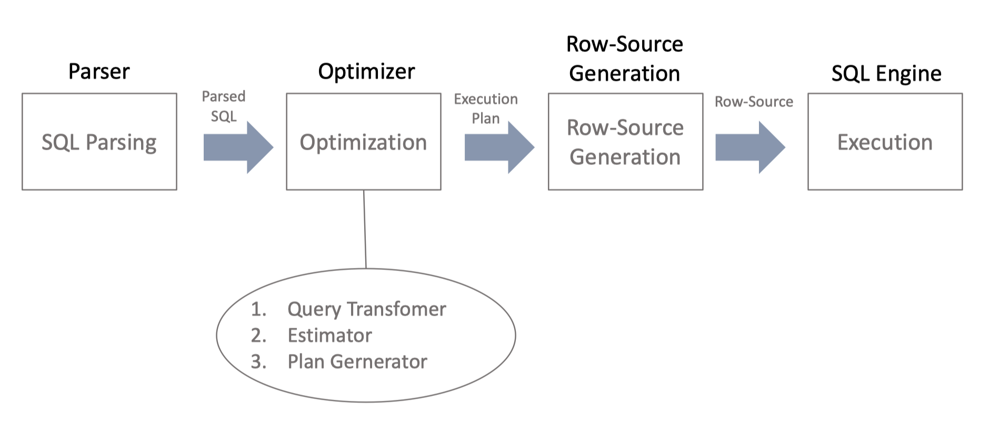
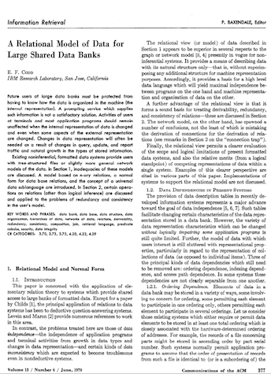
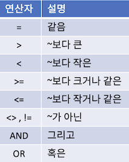
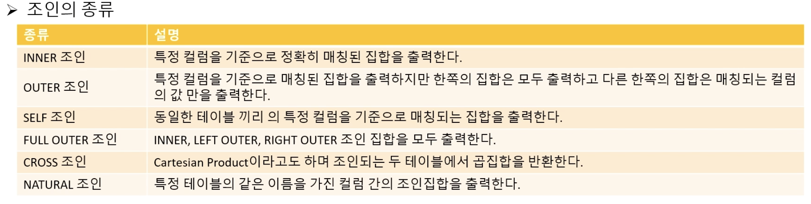
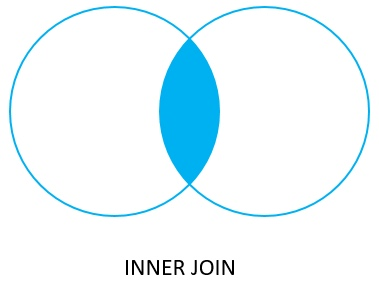

# 내 생각대로 SQL
# 내 생각대로 SQL - Basic
## About SQL
* SQL은 1974년에 SEQUEL (씨퀄)로 탄생 했지만, 지금 이름인 SQL로 변경 되어 지금까지 SQL 불린다. 그러나 에 스-큐-엘 이 아닌 씨퀄로 주로 발음된다.
* SEQUEL : A STRUCIURED ENGLISH QUERY LANGUAGE
* SQL : A STRUCIURED QUERY LANGUAGE

### SQL의 특성
* 절차적 언어(procedural language)가 아닌 선언적 언어(descriptive language)
	- 즉, 데이터를 처리하기 위한 방법을 기술하지 않고, 필요한 데이터 집합을 정의함.
* 데이터 처리 방법을 고민하지 않고 데이터 자체만 집중 할 수 있음.
	- 데이터 처리 방법은 SQL Query Optimizer 가 대신 처리함. 필요한 데이터 집합을 SQL 로 정의하면 Query Optimizer 가 SQL를 처리 데이터, 하드웨어, 테이블 구조를 고려하여 처리하기 때문에, Data Scientist, Data Analyst 는 Business Problem 에 더 집중할 수 있음.

* 플랫폼에 독립적임
	* 수정을 거의 하지 않고 다른 DBMS 에서도 활용할 수 있어 플랫폼에 독립적임 ( SQL on Hadoop 포함 심지어 Access 에서도!!)

### SQL 역할과 활용
* Data Preparation, Data Analysis에 활용 할 수 있다.
* Model과 Algorithm을 만드는데는 부분적으로 활용할 수 있다.


## 관계형 모델과 SQL
### 관계형 모델
* 관계형 모델(Relational Model) EF Codd 박사님이 1969년 만든 데이터 독립성이 보장된 최초의 데이터 모델입니다.


* 물리(Physical) = Ordering, Indexing, Access Path 종속적
* 논리(Logical) = 데이터 항목 자체에 집중


### Entity Relationship Diagram

* RDBM을 표현할 때 사용


## 실습 환경
### SQL 쿼리 Tool
* DBeaver 사용 : [DBeaver](https://dbeaver.io/download/)

## SELECT 문
* 일반적으로 테이블에 저장된 데이터를 가져오는데 쓰인다. SQL에서 가장 많이 쓰이는 문장이다.

### 문법
```sql
SELECT COLUMN_1, COLUMN_2, COLUMN_3, ....
FROM TABLE_NAME;
```

```sql
SELECT T.COLUMN_1, T.COLUMN_2, T.COLUMN_3, ....
FROM TABLE_NAME T;
```
* table name에 Alias를 사용할 수 있다.

### 예제
```sql
select * from customer;

select first_name, last_name, EMAIL from customer;
```

## ORDER BY 문
* SELECT문에서 가져온 데이터를 정렬하는데 사용한다. 업무 처리상 매우 중요한 기능이다.
### 문법
```sql
SELECT COLUMN_1, COLUMN_2
FROM TABLE_NAME
ORDER BY COLUMN_1 ASC, COLUMN_2 DESC
```

* 정렬 순서를 입력하지 않을 경우 ASC가 Default이다.
```sql
SELECT COLUMN_1, COLUMN_2
FROM TABLE_NAME
ORDER BY 1 ASC, 2 DESC
```

* 컬럼명 대신 정수를 입력해도 된다. (가독성은 낮음)

### 예제
```sql
select first_name, last_name from customer order by first_name asc;

select first_name, last_name from customer c order by first_name asc, last_name desc;

select first_name, last_name from customer c order by 1 asc, 2 desc;
```

## SELECT DISTINCT 문

* SELECT시 DISTINCT를 사용하면 중복값을 제외한 결과값이 출력된다. 즉 같은 결과의 행이라면 중복을 제거할 수 있다.

### 문법
```sql
SELECT DISTINCT COLUMN_1 FROM TABLE_NAME;

SELECT DISTINCT COLUMN_1, COLUMN_2 FROM TABLE_NAME;

SELECT DISTINCT COLUMN_1, COLUMN_2 FROM TABLE_NAME ORDER BY COLUMN_1, COLUMN_2;
```
* 컬럼을 2개 작성한 경우 COLUMN_1 + COLUMN_2의 중복값을 제거한다.

### 예제
```sql
select * from t1;

select distinct bcolor from t1 order by bcolor;

select distinct bcolor, fcolor from t1 order by bcolor, fcolor;

// bcolor 기준 중복 제거된 값이 기준 집합이 됨
select distinct on (bcolor) bcolor, fcolor from t1 order by bcolor, fcolor;
select distinct on (bcolor) bcolor, fcolor from t1 order by bcolor, fcolor desc;
```

## WHERE 절
* 집합을 가져올 때 어떤 집합을 가져올 것인지에 대한 조건을 설정하는 절이다.

### 문법
```sql
SELECT COLUMN_1, COLUMN_2, ... 
FROM TABLE_NAME
WHERE <조건>;
```
* 조건 :


### 예제
```sql
select first_name, last_name from customer where first_name = 'Jamie';

select first_name, last_name from customer where first_name = 'Jamie' and last_name = 'Rice';

select customer_id, amount, payment_date from payment where amount <= 1 or amount >= 8;
```

## 생각대로 SQL 1
```sql
문제1번) dvd 렌탈 업체의  dvd 대여가 있었던 날짜를 확인해주세요.
select
	distinct date(rental_date)
from
	rental

문제5번) 영화 카테고리 중에서 ,Sci-Fi  카테고리의  카테고리 번호는 몇번인가요?	
select
	category_id
from
	category c
where
	name = 'Sci-Fi';

문제6번) film 테이블을 활용하여, rating  등급(?) 에 대해서, 몇개의 등급이 있는지 확인해보세요. 	
select
	distinct rating
from
	film;

/*
PG-13
NC-17
G
PG
R
 */

문제7번) 대여 기간이 (회수 - 대여일) 10일 이상이였던 rental 테이블에 대한 모든 정보를 알려주세요.
단 , 대여기간은  대여일자부터 대여기간으로 포함하여 계산합니다.	
select
	*,
	date(return_date) - date(rental_date) + 1 as chk
from
	rental
where
	date(return_date) - date(rental_date) + 1 >= 10;

문제8번) 고객의 id 가  50,100,150 ..등 50번의 배수에 해당하는 고객들에 대해서, 
회원 가입 감사 이벤트를 진행하려고합니다.
고객 아이디가 50번 배수인 아이디와, 고객의 이름 (성, 이름)과 이메일에 대해서 
확인해주세요.	
select
	customer_id,
	last_name || ', ' || first_name as full_name ,
	email
from
	customer
where
	customer_id % 50 = 0;

문제10번)	city 테이블의 city 갯수는 몇개인가요?	
select
	count(distinct city_id)
from
	city;

문제11번)	영화배우의 이름 (이름+' '+성) 에 대해서,  대문자로 이름을 보여주세요.  단 고객의 이름이 동일한 사람이 있다면,  중복 제거하고, 알려주세요.	
select
	distinct UPPER(first_name || ' ' || last_name)
from
	actor;

문제17번)	film 테이블을 활용하여,  rental_duration 이  7일 이상 대여가 가능한  film 에 대해서  film_id,   title,  description 컬럼을 확인해보세요.	
select
	film_id,
	title,
	description,
	rental_duration
from
	film
where
	rental_duration >= 7;
```

## LIMIT 절
* 특정 집합을 출력 시 출력하는 행의 수를 한정하는 역할을 한다. 부분 범위 처리시 사용된다.

### 문법
```sql
select * from table_name limit n;

select * from table_name limit n offset m;
```

*  offset은 출력 시작위치를 지정한다.

### 예제
```sql
select film_id, title, release_year from film order by film_id limit 5;

select film_id, title, release_year from film order by film_id limit 4 offset 3;

select film_id, title, rental_rate from film order by rental_rate desc limit 10;
```

*  `offset n` 일 경우 n+1 행부터 출력한다.

### FETCH 절
* 특정 집합을 출력 시 출력하는 행의 수를 한정하는 역할을 한다. 부분 범위 처리시 사용된다.

### 문법
```sql
select * from table_name fetch first [n] row only
```

* 출력하는 행의 수를 지정한다. N을 입력하지 않고 ROW ONLY만 입력하면 단 한 건만 출력한다.

```sql
select * from table_name offset n rows fetch first [n] row only
```

* 출력하는 행의 수를 지정하면서 시작위치를 지정한다. OFFSET N값의 시작위치는 0이다.

### 예제

```sql
select film_id, title from film order by title fetch first row only;

select film_id, title from film order by title fetch first 1 row only;

select film_id, title from film order by title offset 5 rows fetch first 5 row only;
```

## IN 연산자
* 특정 집합(컬럼 혹은 리스트)에서 특정 집합 혹은 리스트가 존재하는지 판단하는 연산자이다.

### 문법

```sql
select * from table_name where column_name in (value1, value2, ...)
```

* column_name이 가지고 있는 집합에서 value1, value2 등의 값이 존재하는지 확인

```sql
select * from table_name where column_name in (select column_name2 from table_name2)
```

* column_name이 가지고 있는 집합에서 table_name2 테이블의 column_name2의 집합이 존재하는지 확인

### 예제
```sql
select customer_id, rental_id, return_date from rental where customer_id in (1, 2) order by return_date desc;
select customer_id, rental_id, return_date from rental where customer_id = 1 or  customer_id = 2 order by return_date desc;

select customer_id, rental_id, return_date from rental where customer_id not in (1, 2) order by return_date desc;

select customer_id from rental where cast (return_date as date) = '2005-05-27';
select customer_id from rental where date(return_date) = '2005-05-27';
select first_name, last_name, customer_id from customer where customer_id in (select customer_id from rental where cast (return_date as date) = '2005-05-27')
```

## BETWEEN 연산자

## LIKE 연산자

```sql

```


## IS NULL 연산자


## 조인과 집계 데이터
### 조인이란
* 2개 이상의 테이블에 있는 정보 중 사용자가 필요한 집합에 맞게 가상의 테이블처럼 만들어서 결과를 보여주는 것이다.


### INNER 조인
* 특정 컬럼을 기준으로 정확히 매칭된 집합을 출력한다. INNER 조인은 대표적인 조인의 종류이다.


#### 예제
```sql
select
	a.id id_a,
	a.fruit fruit_a b.id id_b b.fruit fruit_b
from
	basket_a a
inner join basket_b b on
	a.fruit = b.fruit;
```

```sql
select
	A.CUSTOMER_ID,
	A.FIRST_NAME,
	A.LAST_NAME,
	A.EMAIL,
	B.AMOUNT,
	B.PAYMENT_DATE,
	C.FIRST_NAME as S_FIRST_NAME,
	C.LAST_NAME as S_LAST_NAME
from
	CUSTOMER A
inner join PAYMENT B
on
	A.CUSTOMER_ID = B.CUSTOMER_ID
inner join STAFF C
on
	B.STAFF_ID = C.STAFF_ID;
```

### OUTER 조인
* 특정 컬럼을 기준으로 매칭된 집합을 출력하지만 한쪽의 집합은 모두 출력하고 다른 한쪽의 집합은 매칭되는 컬럼의 값 만을 출력한다.


#### 예제
* LEFT OUTER JOIN
```sql
select
	A.ID as ID_A,
	A.FRUIT as FRUIT_A,
	B.ID as ID_B,
	B.FRUIT as FRUIT_B
from
	BASKET_A A
left join BASKET_B B 
on
	A.FRUIT = B.FRUIT;
```


* LEFT OUTER JOIN - LEFT ONLY
```sql
select
	A.ID as ID_A,
	A.FRUIT as FRUIT_A,
	B.ID as ID_B,
	B.FRUIT as FRUIT_B
from
	BASKET_A A
left join BASKET_B B 
on
	A.FRUIT = B.FRUIT
where
	B.ID is null;
```


* RIGHT OUTER JOIN
```sql
select
	A.ID as ID_A,
	A.FRUIT as FRUIT_A,
	B.ID as ID_B,
	B.FRUIT as FRUIT_B
from
	BASKET_A A
right join BASKET_B B 
on
	A.FRUIT = B.FRUIT;
```


* RIGHT OUTER JOIN - RIGHT ONLY
```sql
select
	A.ID as ID_A,
	A.FRUIT as FRUIT_A,
	B.ID as ID_B,
	B.FRUIT as FRUIT_B
from
	BASKET_A A
right join BASKET_B B 
on
	A.FRUIT = B.FRUIT;
where A.ID is null;
```


### SELF 조인
* 같은 테이블끼리 특정 컬럼을 기준으로 매칭되는 컬럼을 출력하는 조인이다.
* 즉 같은 테이블의 데이터를 각각의 집합으로 분류한 후 조인한다.

#### 예제
```sql
select
	E.FIRST_NAME || ' ' || E.LAST_NAME EMPLOYEE,
	M.FIRST_NAME || ' ' || M.LAST_NAME MANAGER
from
	employee e
inner join employee m
on
	m.employee_id = e.manager_id 
order by
	manager;
```

* SELF LEFT OUTER JOIN
```sql
select
	E.FIRST_NAME || ' ' || E.LAST_NAME EMPLOYEE,
	M.FIRST_NAME || ' ' || M.LAST_NAME MANAGER
from
	employee e
left join employee m
on
	m.employee_id = e.manager_id 
order by
	manager;
```

* 부정형 조건
```sql
select
	E.FIRST_NAME || ' ' || E.LAST_NAME EMPLOYEE,
	M.FIRST_NAME || ' ' || M.LAST_NAME MANAGER
from
	employee e
left join employee m
on
	m.employee_id = e.manager_id 
order by
	manager;
```

### FULL OUTER 조인
* INNER, LEFT OUTER, RIGHT OUTER 조인 집합을 모두 출력하는 조인 방식이다.
* 즉 두 테이블간 출력가능한 모든 데이터를 포함한 집합을 출력한다.

#### 예제
* FULL OUTER JOIN
```sql
select
	A.ID ID_A,
	A.FRUIT FRUIT_A,
	B.ID ID_B,
	B.FRUIT FRUIT_B
from
	BASKET_A A
full outer join BASKET_B B
 on
	A.FRUIT = B.FRUIT;
```


* FULL OUTER JOIN - ONLY OUTER JOIN
```sql
select
	A.ID ID_A,
	A.FRUIT FRUIT_A,
	B.ID ID_B,
	B.FRUIT FRUIT_B
from
	BASKET_A A
full outer join BASKET_B B
 on
	A.FRUIT = B.FRUIT
where
	A.ID is null
	or B.ID is null;
```


* FULL OUTER + RIGHT ONLY = RIGHT OUTER + RIGHT ONLY

* FULL OUTER + LEFT ONLY = LEFT OUTER + LEFT ONLY


### CROSS 조인
* 두 개의 테이블의 CATESIAN PRODUCT 연산의 결과를 출력한다. 
* 데이터 복제에 많이 쓰이는 기법이다.

#### 예제
```sql
select
	*
from
	cross_t1
cross join cross_t2;
```

### NATURAL 조인
* 두 개의 테이블에서 같은 이름을 가진 컬럼 간의 INNER 조인 집합 결과를 출력한다.
* SQL문 자체가 간소해 지는 방법이다.

#### 예제
```sql
select
	*
from
	products A 
natural join 
	categories B;
```

```sql
select
	A.CATEGORY_ID,
	A.PRODUCT_ID,
	A.PRODUCT_NAME,
	B.CATEGORY_NAME
from
	PRODUCTS A
inner join
 	CATEGORIES B
on
	(A.CATEGORY_ID = B.CATEGORY_ID);
```
*  NATURAL JOIN은 INNER JOIN의 또 다른 SQL 작성 방식이다.
* 즉 조인 컬럼을 명시하지 않아도 된다.


```sql
select
	*
from
	CITY A natural
join
 	COUNTRY B;
```

*  `country_id` 와 `last_update` 이 동시에 성립해야지 결과가 출력한다.
* 이와 같이 예기치 못한 결과를 출력할 수 있기 때문에 실무에서는 NATURAL JOIN을 잘 사용하지 않는다.

### 생각대로 SQL 3


### GROUP BY 절


